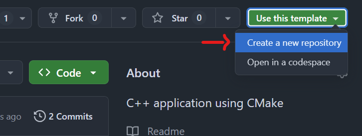
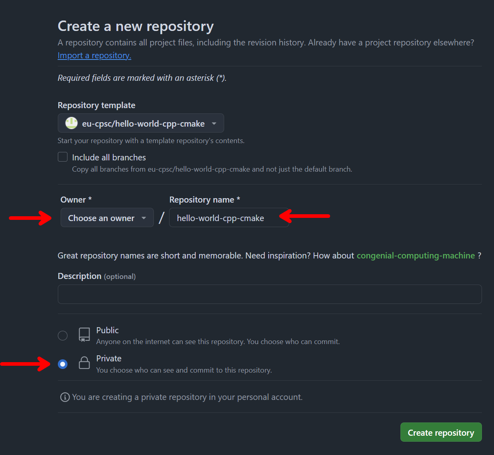
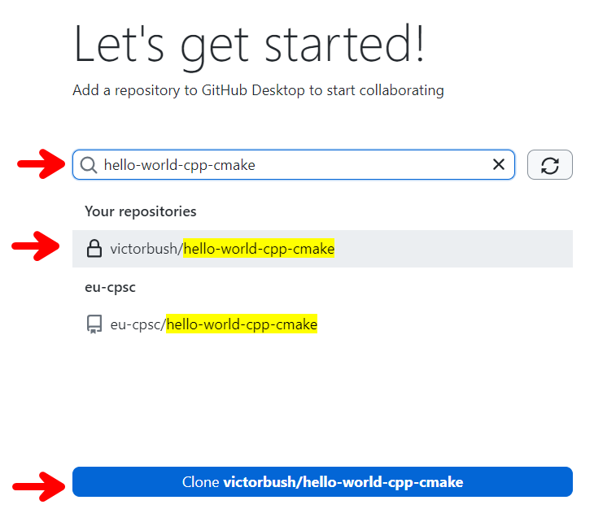
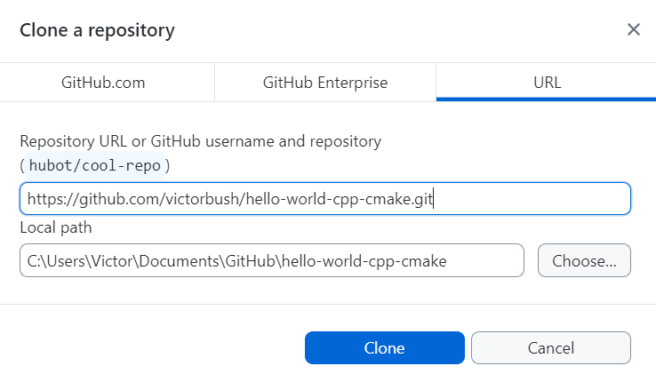
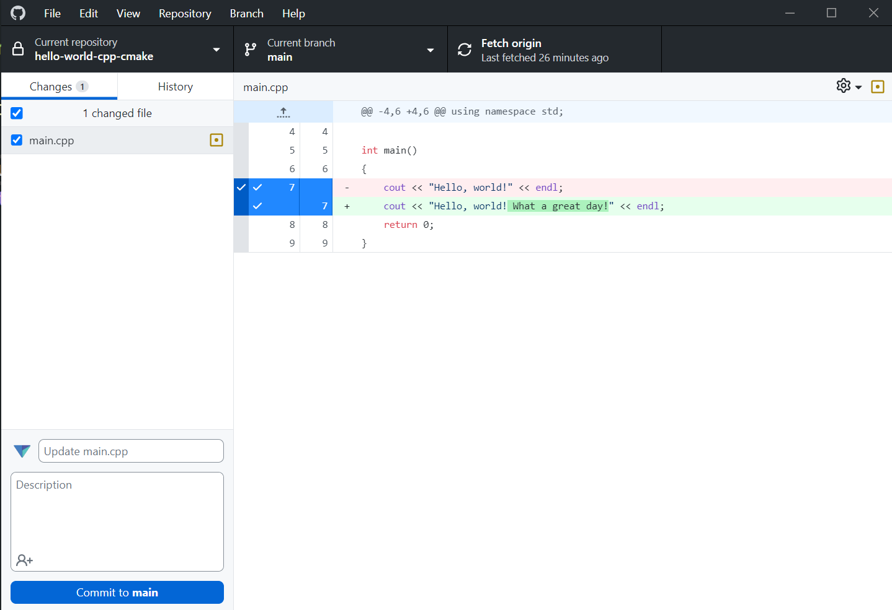
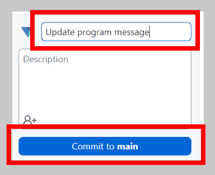
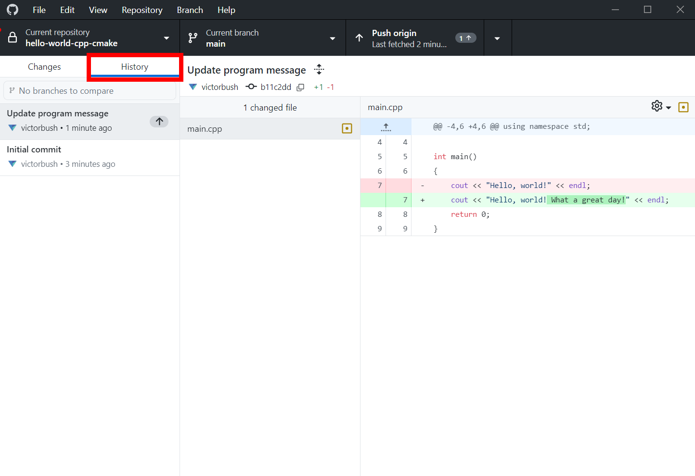
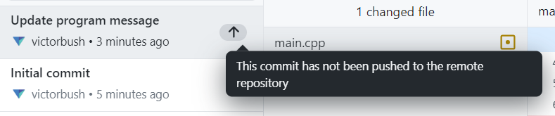
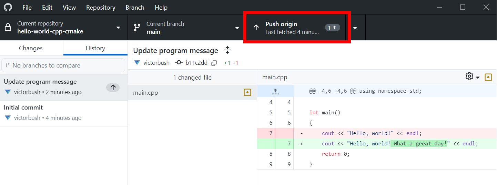
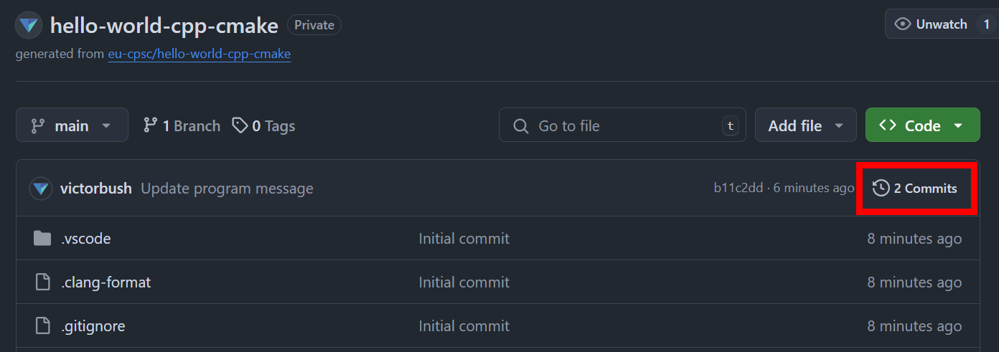

# C++ Quickstart: IDE and GitHub Setup

After following this instructions in this guide, you will be able to:

- Clone a repository from GitHub to your computer.
- Build and run C++ applications on your computer.
- Commit and push changes back to GitHub.

## 1. Create a GitHub account

Go to [github.com](github.com) and create an account if you don't have one already.

Accounts are free to create. You are not required to use your Evangel email address to sign up; however, if you associate your Evangel email address with your GitHub account, you can apply for GitHub Education [student benefits](https://education.github.com/pack) (it does not have to be the primary email address on the account).

## 2. Create a sample repository

Go to the [hello-world-cpp-cmake](https://github.com/eu-cpsc/hello-world-cpp-cmake) template on GitHub.

This contains a very simple C++ program you can use to verify your computer is properly set up to develop C++ programs.

Click the **Use this template** button and select **Create a new repository**.



Set the owner of the new repository to your GitHub account. Pick a name for the new repository.

You can make this a private repository that only you can see.



## 3. Install GitHub Desktop

Download and install the [GitHub Desktop](https://github.com/apps/desktop) app on your computer.

Open the GitHub Desktop app and sign in. Follow the instructions in the app until you get the the **Let's get started** screen.

## 4. Clone your repository

In the GitHub Desktop app, search for the repository you created earlier and click the button to clone it.



You can change the directory on your computer where the repository will be cloned into, or you can use the default location.



Click the **Clone** button and the GitHub Desktop app will clone the repository to your computer.

## 5. Install a C++ compiler and editor

You will need a way to compile C++ programs using CMake. You are free to use whatever IDE/editor/compiler combination you'd like; however, there are two officially supported options depending on what operating system you are using.

Follow the instructions for your operating system below:

- [Windows and Visual Studio 2022](./ide-windows-vs.md)
- [Mac and Visual Studio Code](./ide-mac-vscode.md)

Once you have your IDE installed and working, come back here and continue with the instructions below.

## 6. Edit the sample program

Edit the `main.cpp` file and change edit the `"Hello, world!"` message to something else. For example:

```
cout << "Hello, world! What a great day!" << endl;
```

Make sure to save the `main.cpp` file. When you run your program, you should see your modified message printed to the terminal window.

## 7. Commit changes

Go back to the GitHub Desktop app. You will see your changes to `main.cpp` show up in the changes list.



Git allows us to track changes to files over time. It provides a log of changes to the files in the repository. To create our first entry in this log, we need to create a commit.

Enter a commit message in the box in the lower-left corner. This is a message indicating what changes were made and why.



Click the `Commit to main` button to commit your current changes to the `main` branch.

You can view the log of commits in your repository in the **History** tab in the GitHub Desktop app.



## 8. Push changes

A new commit with your changes has been recorded in your local repository on your computer, but these changes are not automatically stored on github.com. You need to _push_ your local commits back to GitHub.

In this history list, an arrow will appear next to commits that have not been pushed to the remote github.com repository.



In GitHub Deskotp, click the **Push origin** button at the top of the window to push your newly created commits to your remote repository on github.com.



**Important**: When working on course assignments, you must remember to push your commits to github.com in order to get credit!

You can confirm which commits are stored in your github.com repository by opening the repository in your web browser and clicking the **Commits** button.


