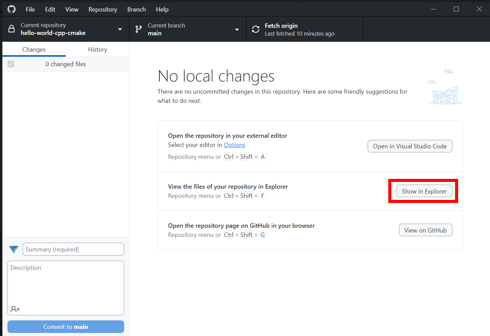

# Using Visual Studio Code on Mac

These instructions demonstrate how to set up and use Visual Studio Code on Mac. The Clang compiler is used to compile C++ code.

## Install Clang

Check if Clang is installed on your Mac. To do this, open a terminal window and enter:

```
clang --version
```

If Clang is installed, you will see the version number that is installed.


If Clang is not installed, you will see a message indicating the command was not found. In that case, enter the following command in the terminal window:

```
xcode-select --install
```

Follow the instructions on screen to install the command line developer tools. This will install Clang.

## Install the Homebrew package manager

Go to https://brew.sh and follow the instructions to install the Homebrew package manager. You will have to copy a command and paste it into the Terminal app on your Mac.

Once completed, restart the Terminal app.

## Install CMake

In the Terminal app, execute the following command:

```
cmake --version
```

If CMake is installed correctly, this command will display the version of CMake you have installed.

If you get an error that says something like "command not found", then you need to install CMake.

In the Terminal app, execute the following command:

```
brew install cmake
```

Follow the instructions provided. When complete, close the Terminal window and open a new one.

Execute the following command to verify CMake is installed correctly:

```
cmake --version
```

## Install Visual Studio Code

Install [Visual Studio Code for Mac](https://code.visualstudio.com/docs/setup/mac). Make sure to copy the app into the Applications folder on your Mac.

## Open your project folder

In the top menu, select **File** -> **Open folder**.

TODO: IMAGE

Find the folder to cloned your repository into and click **Select Folder**.

TODO: IMAGE

If you don't remember where the folder is, you can click the "Show in Explorer" button in GitHub Desktop. This will open the folder in File Explorer.



Once you open the folder in Visual Studio, open the **Solution Explorer** panel. You should see all the files in your repository folder within the solution explorer. If you don't see any files in the folder, you've done something wrong.

TODO: IMAGE

TODO: Open in VS Code from GitHub Desktop

## Install extensions

Open the **Extensions** panel in VS Code. Install the following two extensions:

- C/C++ (search for `ms-vscode.cpptools`)
- CMake Tools (search for `ms-vscode.cmake-tools`)

TODO: IMAGE

## Configure CMake

Open the **CMake Tools** panel. The icon looks like:


In the **CMake Tools** panel, find the **Configure** section and click the button to **Select a Kit**.


Select the Clang option from the list at the top of the window. If you don't see a Clang option, make sure Clang is installed (see instructions at the top of this document).


In the **CMake Tools** panel, find the **Build** section and click the button to change the build target.


Select the `hello-world` option from the list at the top of the window.


## Build and run

You are now ready to build and run the program. Open the `main.cpp` file from the **Explorer** panel. A text editor tab should open and show the file contents.

At the bottom of the VS Code window, click the **Build** button.


If the build succeeds, you will see something like "Build finished with exit code 0" in the output window. If the build fails, switch to the **Problems** tab of the output panel and inspect any errors that are shown.

Once the build succeeds, you can run the program by clicking the play button at the bottom of the VS Code window.


## Continue quickstart guide

Continue the [C++ quickstart guide](./README.md).
