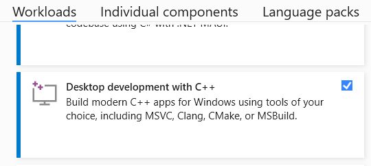
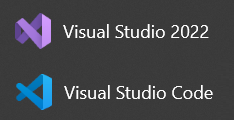
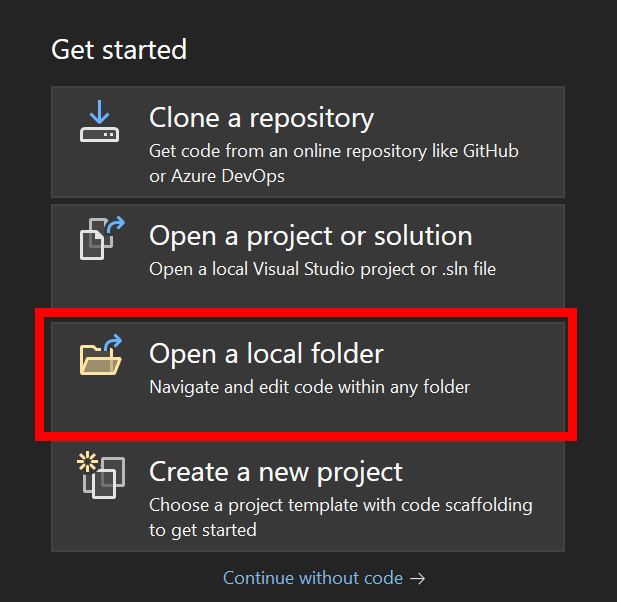
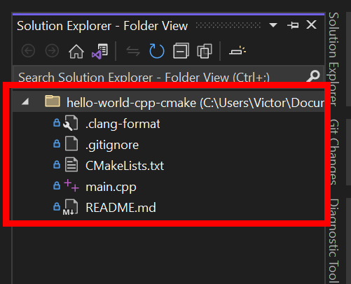
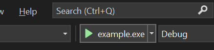

# Using Windows and Visual Studio

These instructions demonstrate how to set up and use Visual Studio 2022 on Windows.

**If you are using a Mac, these are not the instructions you are looking for.**

## Install Visual Studio 2022 Community

Download and install the _community_ edition of Visual Studio 2022 [here](https://visualstudio.microsoft.com/vs/community/). The community edition is free.

In the Visual Studio Installer, make sure you check the **Desktop development with C++** workload. If you've previously installed Visual Studio but did not check this box, you can reopen the Visual Studio Installer and modify the existing installation to include this workload.

**Note:** Visual Studio and Visual Studio Code (also known as VS Code) are not the same thing. These are two separate applications.

We recommend using Visual Studio if you are on a Windows computer. It is possible to use VS Code on Windows to develop C++ applications, but VS Code does not come bundled with a C++ compiler. Therefore, you still need to install Visual Studio (or another C++ compiler) before using VS Code.

## Open your project folder

Open Visual Studio 2022. From the **Get Started** screen, click **Open a local folder**. If you don't see this option, you can use the top menu and choose **File** -> **Open** -> **Folder**.

Find the folder you cloned your repository into and click **Select Folder**.

If you don't remember where the folder is, you can click the **Show in Explorer** button in GitHub Desktop. This will open the folder in File Explorer.

Once you open the folder in Visual Studio, open the **Solution Explorer** panel. You should see all the files from your repository in the Solution Explorer panel. If you don't see any files, you've done something wrong.

## Build and run

In the **Solution Explorer**, double click the `main.cpp` file to open it.

Click the green play button in the toolbar to build and run the program.

If the button does not say `example.exe`, click the arrow on the right side of the button and select it from the list. If the list is empty, wait a few seconds and try again. Visual Studio has to process the CMake project first, which can take a moment.

The program should build and run, and you should see the `Hello, world!` message printed to the terminal window.

## Continue quickstart guide

Continue the [C++ quickstart guide](./README.md).
