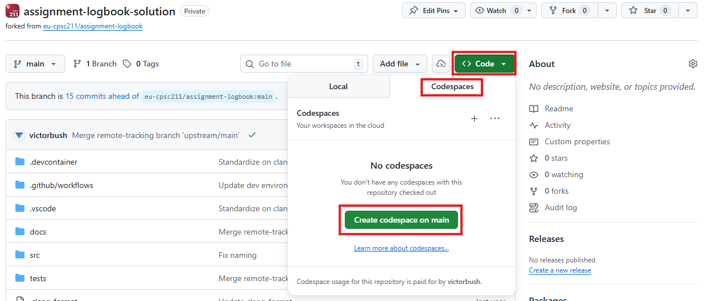
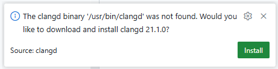
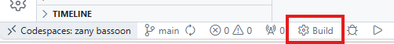
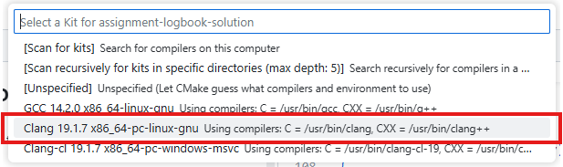
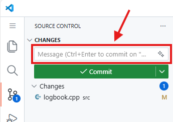
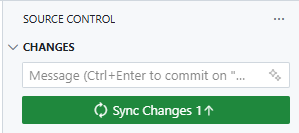
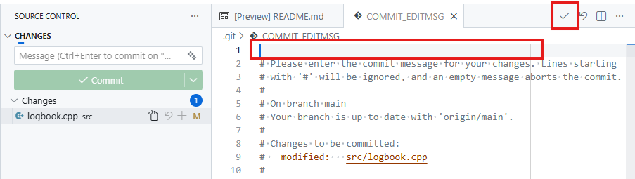
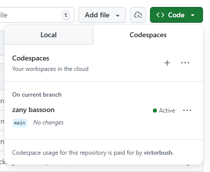

# GitHub Codespaces

Programming assignments in this course support GitHub Codespaces. This allows you to work in an online, browser-based version of Visual Studio Code. This supports a wide range of devices (Windows, Mac, Chromebook, iPad, etc.).

## Create a Codespace

To create a Codespace, open your assignment repository in the GitHub web site.

- Click the **Code** button.
- Click the **Codespaces** tab in the popup.
- Click **Create codespace on main**.

 
 

This will create a new Codespace for your repository and open an online instance of VS Code connected to your Codespace.

Be patient as the Codespace starts up. Initial setup time can take a couple minutes.

### Install clangd

Once your Codespace is up and running, you will need to install the clangd binary. The clangd extension should already be installed, but it depends on having the clangd language server installed.

- Open the Command Pallette with `Ctrl` + `Shift` + `P`.
- Run the command: `> clangd: Restart language server`.
- A popup should appear in the corner of the window asking to install the clangd binary. Click **Install**.

clangd should now be installed and working. If the clangd language server stops working or behaves strangely, you can use the command above to restart the language server.

### Configure CMake

Click **Build** button at the bottom of the VS Code window.

A list of compilers will popup. Choose the Clang compiler ending with `pc-linux-gnu`.

If no compilers show up in the list, click `[Scan for kits]` and try again.

## Committing Changes

Changes you make within the Codespace are saved automatically.

**Important! Read below!**

You must commit and push your changes, otherwise your changes will be lost when the Codespace is deleted.

You will not get credit for assignments if you do not commit and push your changes. Instructors cannot see your code inside of a Codespace.

Use the **Source Control** panel in VS Code to commit and push.

**You must enter a message in the box above the Commit button.**

Once you have committed, you must push (or sync) changes in or for them to show up in your GitHub repository. Click the **Sync Changes** button to do this.

If clicking the **Commit** button starts and operation but doesn't appear to finish, most likely you did not enter a commit message and VS Code is waiting for you to enter one in the **COMMIT_EDITMSG** editor.

## Managing Codespaces

If you close your browser window, your Codespace is still available.

Use the **Code** button to view you existing Codespaces. You can click on a Codespace to open in.

You can also delete a Codespace using the three dots to the right of the Codespace name in the list. **You will lose any changes that you haven't pushed to your repository.** Make sure you commit and push your changes within your Codespace before deleting.

Codespaces are automatically deleted after so many days of inactivity.
