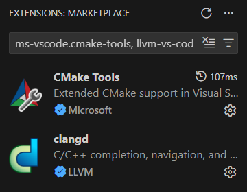

# Visual Studio Code on macOS

## Install Clang

Visual Studio Code (often abbreviated VS Code) does not come with a C++ compiler built in. A separate C++ compiler must be installed. For this course, we will use Clang.

To get Clang, install the Xcode command line developer tools. To do this, open a terminal window and enter:

```
xcode-select --install
```

Follow the instructions on screen to install the command line developer tools. This will install Clang.

Enter the following command in a terminal window to accept the Xcode license.

```
sudo xcodebuild -license accept
```

Once complete, verify Clang is installed. Enter this command in the terminal window:

```
clang --version
```

If Clang is installed correctly, you will see the version number that is installed (your version number may be newer than the screenshot below).


## Install Homebrew

Homebrew is a package manager for macOS. Follow the instructions [here](https://brew.sh/) to install it.

## Install CMake

After installing Homebrew, use it to install CMake. CMake is a build tool that helps build and manage C++ projects.

```
brew install cmake
```

Once complete:

- Close the terminal window and then open a new one.
- Execute the following command to verify CMake is installed correctly:

```
cmake --version
```

## Install Ninja

Ninja is a build system used in conjunction with CMake. Install it using Homebrew.

```
brew install ninja
```

## Install Visual Studio Code

Install [Visual Studio Code for Mac](https://code.visualstudio.com/docs/setup/mac).

Make sure to put the app file (`Visual Studio Code.app`) into your **Applications** folder.

## Install VS Code Extensions

Open the **Extensions** panel in VS Code. Install the following two extensions:

- C/C++ (search for `ms-vscode.cpptools`)
- CMake Tools (search for `ms-vscode.cmake-tools`)



## Install GitHub Desktop

Download and install the GitHub Desktop app [here](https://github.com/apps/desktop).

You will need a GitHub account. If you don't have one, create one now.
