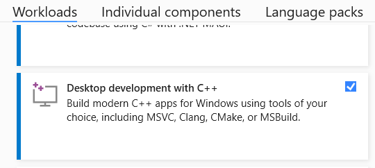

# Visual Studio Code on Windows

## Important Note

For this course, instructions have been standardized to target using VS Code for development. The reason for this is to have the same set of instructions both Windows and macOS. VS Code runs on both systems; Visual Studio 2022 does not.

**Visual Studio 2022** and **Visual Studio Code** (often abbreviated VS Code) are _two separate applications_. They are not the same thing!

On Windows, however, in order to use VS Code to develop C++ programs, _you must also install Visual Studio 2022_. Visual Studio 2022 includes the MSVC C++ compiler. VS Code does not include any compiler.

If you prefer, you can use Visual Studio 2022 directly without using VS Code. This will not be supported in any instructions posted for the course, so if you are unfamiliar with Visual Studio, we suggest sticking with VS Code.

## Install Visual Studio 2022 Community

**You must install this to get the MSVC C++ compiler.**

Download and install the _community_ edition of Visual Studio 2022 [here](https://visualstudio.microsoft.com/vs/community/). The community edition is free.

In the Visual Studio Installer, make sure you check the **Desktop development with C++** workload. If you've previously installed Visual Studio but did not check this box, you can reopen the Visual Studio Installer and modify the existing installation to include this workload.

## Install Visual Studio Code

Download and install Visual Studio Code [here](https://code.visualstudio.com/docs/setup/windows).

## Install VS Code Extensions

Open the **Extensions** panel in VS Code. Install the following two extensions:

- CMake Tools (search for `ms-vscode.cmake-tools`)
- clangd (search for `llvm-vs-code-extensions.vscode-clangd`)

## Install GitHub Desktop

Download and install the GitHub Desktop app [here](https://github.com/apps/desktop).

You will need a GitHub account. If you don't have one, create one now.
