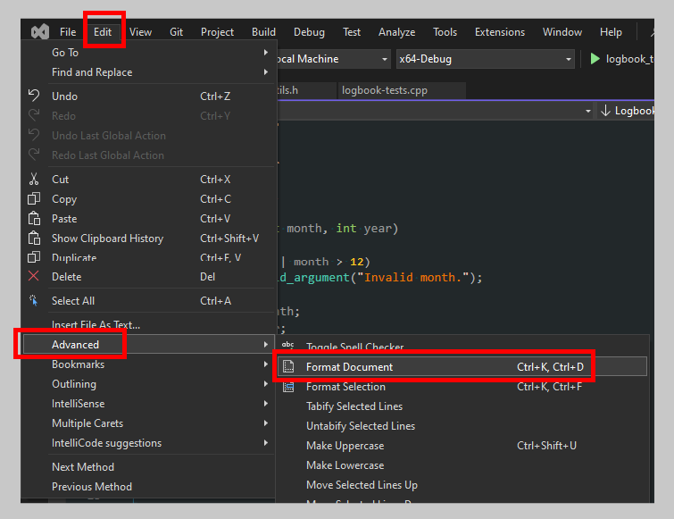
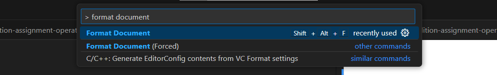

# Course Code Style Guide

## Expectations

Code written for assignments submitted via GitHub must adhere to the guidelines outlined below. zyBook activities and challenges are **not** evaluated based on these guidelines.

There is room for minor deviation from the guidelines. It is understood that a student may miss an item now and then. Sometimes guidelines are broken for other reasons depending on the situation. This is fine. They are _guidelines_ after all, not laws. However, major deviations or continually ignoring guideliness will lead to penalties during grading.

If something is not covered by these guidelines, use your best judgement. There is no penalty for styling choices outside these guidelines.

## Rationale

Why have style guidelines? A consistent code style helps multiple developers read, write, and update code within shared projects. Companies or teams usually have some variation of coding style guidlines. Benefits of this include:

- keeping focus on semantics and logic, not on formatting.
- consistency, eliminating surprises, and improving readability.
- helping avoid common coding pitfalls.

There may be objective reasoning behind certain guidelines, but many are subjective. Different developers have different opinions and preferences. There is no "correct" set of style guidelines. It is more important for a team to aim for consistency than to follow individual preferences.

Why have style guidelines for a course? This course is not a team or corporate environment. Worrying about such matters may seem trivial. There are two reasons for doing so:

- expose students to the real-world concept of style guidelines.
- encourage attention to detail when writing code.

## Guidelines

Below are the coding style guidelines for programming assignments done in this course.

### Use clang-format

The clang-format tool can help automatically format C++ code. Each assignment in this course will come with a `.clang-format` file. Both Visual Studio 2022 and Visual Studio Code will recognize this file and use it to apply code formatting.

**NOTE:** This automatic formatting does not cover all points mentioned in the style guideline. It will not help you name variables or functions and it will not write comments for you. The automatic formatting is a convenience to get you most of the way there.

To format a document in Visual Studio 2022, click **Edit** -> **Advanced** -> **Format Document**. You can also use a shortcut key combination. The default shortcut is to press `Ctrl+K` once, then press `Ctrl+D` once.



To format a document in Visual Studio Code, open the **Command Palette** by pressing `Ctrl+Shift+P` (Windows) or `Cmd+Shift+P` (Mac). You can also click on the search bar at the top of the window.

Within the command palette, type `> Format Document` and press enter. This will format the current document.



### Whitespace

Each statement usually appears on its own line.

```cpp
// DO:

x = 25;
y = x + 1;
```

```cpp
// DON'T:

x = 25;   y = x + 1;
if (x == 5) { y = 14; }
```

Use **four** _spaces_ for indentation. _Tip: enable showing shitespace in your text editor (Visual Studio [example](https://stackoverflow.com/questions/6255839/show-space-tab-crlf-characters-in-editor-of-visual-studio))._

```cpp
// DO

if (a < b) {
    x = 25;
    y = x + 1;
}
```

```cpp
// DON'T

if (a < b) {
x = 25;
        y = x + 1;
}
```

Use consistent indentation. Statements in the same scope should be aligned together. Comments should be aligned with the code they describe.

```cpp
// DO

void SomeFunc()
{
    int x = 0;
    int y = 1;

    // Check something
    if (a < b) {
        // Do something
        x = 25;
        y = x + 1;
    }
}
```

```cpp
// DON'T

void SomeFunc()
{
int x = 0;
        int y = 1;

// Check something
    if (a < b) {
        // Do something
            x = 25;
y = x + 1;
    }
}
```

Use blank lines to separate blocks of code.

```cpp
// DO:

// Compute coordinates
int x = originX + width;
int y = originY + height;

// Wait for laser to charge
int laserPercent = 0;
while (laserPercent < 100)
    laserPercent = CheckLaserChargePercent(x, y);

// Fire laser only if target aquired to avoid malfunction
if (targetAquired)
    fireLaser(x, y);
```

```cpp
// DON'T:

int x = originX + width;
int y = originY + height;
int laserPercent = 0;
while (laserPercent < 100)
    laserPercent = CheckLaserChargePercent(x, y);
if (targetAquired)
    fireLaser(x, y);
```

### Braces

Put the opening brace of branches and loops at end of the same line. Put the closing brace on a new line. The examples below demonstrate this using various constructs. Pay attention to the placement of braces (`{` and `}`).

```cpp
// If statements
if (a < b) {
    // ...
}
else if (b < c) {
    // ...
}
else {
    // ...
}

// While loops
while (x < y) {
   // ...
}

// Switch statements
switch (x) {
case 1:
    // ...
    break;

case 2:
    // ...
    break;

default:
    // ...
    break;
}
```

Braces for function definitions should both be on their own line.

```cpp
// DO:

void MyFunction()
{
    // ...
}
```

```cpp
// DON'T:

void MyFunction() {
    // ...
}
```

### Naming

Variable and parameter names use camelCase.

```cpp
// DO

int numItems;
double boxSize;
string userName;
```

```cpp
// DON'T

int NumItems;
double box_size;
string User_Name;
```

Variable and parameter names should be descriptive of their purpose. Choosing the "right" name is not the point; instead, choose _something_ that helps give appropriate meaning to the variable so other developers can more easily understand your code.

```cpp
// DO

int weight;
int heightInFeet;
int timeMs;
```

```cpp
// DON'T:

int a;
int b;
int theTimeItTakesInMillisecondsToRunALap;
```

A common exception for this guideline is for variables used as an index or counter variable, often named `i` and often in a `for` loop. This is generally considered acceptable and [idomatic](https://en.wikipedia.org/wiki/Programming_idiom).

```cpp
for (int i = 0; i < items.size(); ++i) {
    // ...
}
```

Constants use upper case and underscores.

```cpp
// DO:

const int MAX_WEIGHT = 300;
```

```cpp
// DON'T:

const int MAXWEIGHT = 300;
const int maxWeight = 300;
```

Function names use PascalCase.

```cpp
// DO:

void PrintHello();
```

```cpp
// DON'T:

void printHello();
void print_hello();
```

### Classes

- Class names use PascalCase.
- Member functions names use PascalCase.
- Member variables are prefixed with `m_`, but use camelCase after that.

```cpp
class MyClass {
  public:
    // Public members here.
    void MemberFunction();

  private:
    // Private members here.
    int m_memberVariable;
};
```

### Comments

Code must be appropriately commented in assignment submissions. Comments should describe code at a high level. Use them to communicate intent and clarify why certain code was written. They are an aid to other developers (and your future self); compilers ignore them.

Use comments to highlight the purpose or intent of logically grouped blocks of code.

```cpp
// Have user input employee name
string employeeName;
cout << "Enter employee name: ";
getline(cin, employeeName);
```

Don't write in comments what is already communicated in code. Repeating the syntax of code is redundant and unhelpful (and shows a lack of understanding of what the code does).

```cpp
// Example of unhelpful comments:

// Declare variable to store employee name
string employeeName;

// Display message to enter employee name
cout << "Enter employee name: ";

// Read in line and store in employeeName variable
getline(cin, employeeName);
```

Use comments to clarify the use of loops and branches.

```cpp
// Get the window handle for this process
const int MAX_TRIES = 10;
for (int i = 0; i < MAX_TRIES; ++i)
{
    windowHndl = GetProcessWindow();

    // The window may not be available right away, so wait and try again
    if (!windowHndl)
        Sleep(500);
}
```

Use comments above function delcarations to document their purpose, inputs, and outputs. If the declaration appears in a header file, put the comment in the header file. Do not repeat the comment in both the declaration and definition without reason.

Use the following format for documenting functions:

```cpp
/**
Brief description of the function.

@param param1 Brief description of parameter.
@param param2 Brief description of parameter.
@returns What the function returns (if applicable).
*/
int DoTheThing(int param1, int param2);
```

## Additional Reading

The following links provide are examples of other style guidelines in the wild:

- [Programming: Principles and Practice style guide](https://www.stroustrup.com/Programming/PPP-style.pdf) - style guidelines of a popular C++ textbook written by Bjarne Stroustrup, the creator of C++.
- [C++ Core Guidelines](https://isocpp.github.io/CppCoreGuidelines/CppCoreGuidelines) - more than just style guidelines, includes best practices on using C++.
- [Google C++ Style Guide](https://google.github.io/styleguide/cppguide.html) - style guidelines as used by Google. For a good example of how developers can disagree on style guidelines, search the web a bit and you'll find varying opinions on this particular style guide.
- [Coding Standard for Unreal Engine](https://dev.epicgames.com/documentation/en-us/unreal-engine/epic-cplusplus-coding-standard-for-unreal-engine?application_version=5.4) - used by Epic Games for the Unreal Engine.
