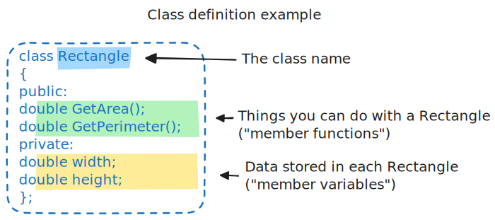
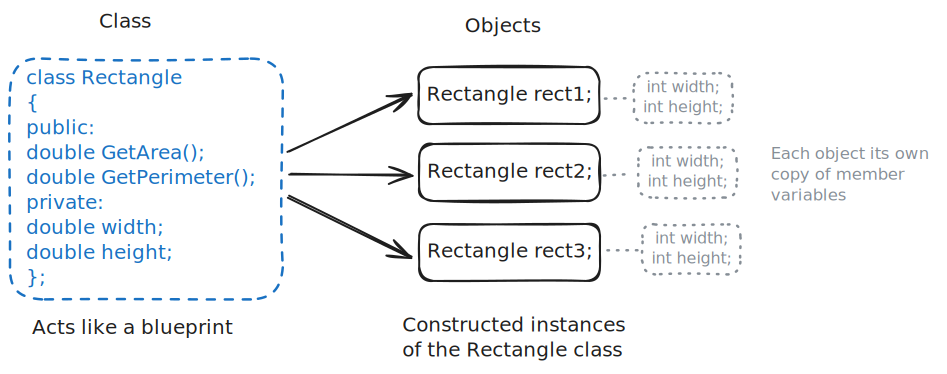
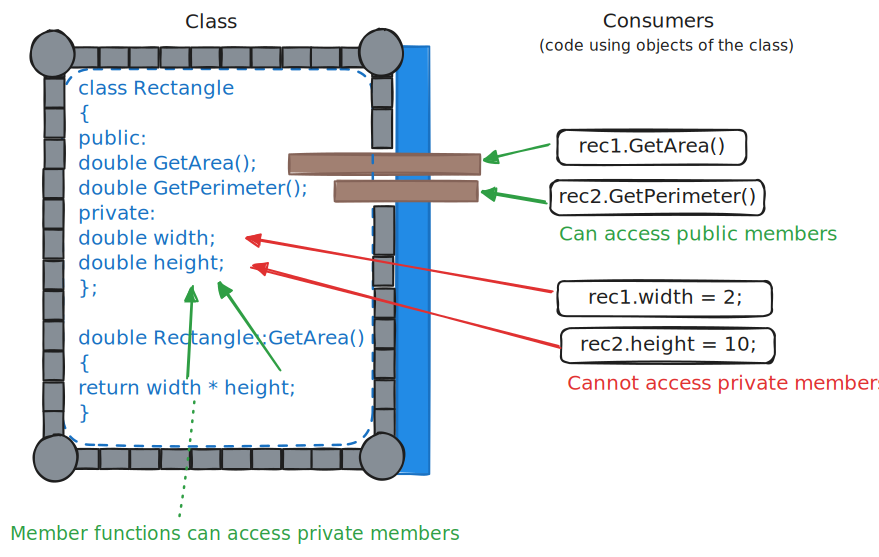

# Objects and Classes

Textbook sections:

- 1.1 Objects: Introduction
- 1.2 Using a class
- 1.3 Defining a class

## C++ as we know it

You should be able to write basic C++ programs. You should know about:

- Variables
  - Defining, assigning, and using variables.
  - Basic data types such as `int`, `float`, `double`, `bool`, `char`, etc.
  - Compound data types such as `string` and `vector`.
- Functions
  - Function _declaration_ vs _definition_.
  - Input parameters, including:
    - Pass-by-value
    - Pass-by-reference
    - `const`
  - Return type

### A simple rectangle program

Here is a simple C++ program that defines a rectangle and prints out its area and perimeter.

```cpp
#include <iostream>

using namespace std;

int main()
{
    // Dimensions of rectangle
    double width = 20;
    double height = 15;

    cout << "Area: " << width * height << endl;
    cout << "Perimeter: " << 2 * (width + height) << endl;

    return 0;
}
```

#### Exercise: extend the simple rectangle program

**Step 1:** add another set of variables to track the dimensions of another rectangle. Add another set of `cout` statements to display the second rectangles area and perimeter.

**Step 2:** refactor the area and perimeter computations into functions.

## C++ classes

A class in C++ lets us group related variables and functions together. These variables and functions are _members_ of the class.

- Functions define the operations that can be performed on a class object.
- Variables define data related to and used by a class object.



A class is like a blueprint. By itself, it doesn't do anything. If you have a blueprint for a house, you don't have a house. You just have the plans that show how to build the house.



In C++ we take a _class_ and build an _object_. An object can be called an _instance_ of a class. Each instance has its own copy of member variables.

### Class definitions

Example `Rectangle` class:

```cpp
class Rectangle
{
public:
    double GetArea();
    double GetPerimeter();
private:
    double width;
    double height;
};
```

### Objects

Replace the original width/height variables and create two `Rectangle` objects instead:

```cpp
int main()
{
    Rectangle rec1;
    Rectangle rec2;

    // ...
}
```

Replace the old area/perimeter function calls with a call to each rectangle's member function:

```cpp
    cout << "Rectangle 1: " << endl;
    cout << "Area: " << rec1.GetArea() << endl;
    cout << "Perimeter: " << rec1.GetPerimeter() << endl;

    cout << endl;

    cout << "Rectangle 2: " << endl;
    cout << "Area: " << rec2.GetArea() << endl;
    cout << "Perimeter: " << rec2.GetPerimeter() << endl;
```

Try to build the program now. You will see an error like:

```
undefined reference to `Rectangle::GetArea()'
undefined reference to `Rectangle::GetPerimeter()'
```

We need to implement these functions.

### Member functions

Look back at the `Rectangle` class definition. Inside, we see `double GetArea();` and `double GetPerimeter();`. These are member function _declarations_. We need to provide the _definitions_ (the actual implementations of the functions).

Update the existing area and perimeter functions:

```cpp
double GetArea()
{
    return width * height;
}

double GetPerimeter()
{
    return 2 * (width + height);
}
```

This still doesn't work. Need to specify the function's scope.

Add a `Rectangle::` prefix to the function name. `::` is the _scope resolution operator_.

```cpp
double Rectangle::GetArea()
{
    return width * height;
}

double Rectangle::GetPerimeter()
{
    return 2 * (width + height);
}
```

Run the program now. Why are we getting garbage output?

```
Rectangle 1:
Area: -2.08158e-272
Perimeter: nan

Rectangle 2:
Area: 3.03428e-86
Perimeter: nan
```

### Exercise: Add a `SetDimensions()` member function

Add a member function that lets us change the width and height of a `Rectangle`. The member function declaration should look like this:

```cpp
void SetDimensions(double newWidth, double newHeight);
```

- Add the member function declaration to the class definition.
- Create the member function definition and implement the function. Don’t forget to prefix the member function with the correct scope resolution (i.e., `Rectangle::`).
- In the program’s main function, call the `SetDimensions()` function for both `rec1` and `rec2` and assign a width and a height for each.

## Member visibility

Refer back to the `Rectangle` class definition. Remember the `public:` and `private:` labels?

- Public members can be used outside of the class. The consumers of a class object can access these members.
- Private members cannot be used outside the class. Member functions within the class can use private members.

Think of a class like a castle. Members of a class are protected by the castle walls. Code outside the class cannot access those members unless they are made public.



By default, members are private unless made public.

### Exercise: Modify member visibility

Try modifying the visibility of the member variables to make them public. Observe how you can access those variables directly. Then modify their visibility back to private and observe how the compiler will prevent you from accessing those members directly.

### Note: Abstraction

Classes are a mechanism for abstraction. They can hide underlying details of how the class is implemented.

**Question:** Why is abstraction a good thing? What are some benefits of hiding implementation details?

## Additional exercises

Use these questions and exercises to help prepare for quizzes and exams.

### Questions

- How do you declare/create an object of a class?
- How do you call a member function of a class (assuming it is public)?
- How do you assign a value to a member variable of a class (assuming it is public)?
- How do you make class members public or private?
- If you don't specify otherwise, what is the default visibility of class members?
- How do you implement a member function _definition_?
- What is the _scope resolution operator_?

The following code attempts to access a private member variable from outside of the class. What will happen?

```cpp
class Foo
{
private:
    int value;
};

int main()
{
    Foo f;
    f.value = 10;
}
```

### Exercise: Create a class

Create a class named `Circle`. Add the following public member functions:

- `void SetRadius(double newRadius)`
- `double GetArea()`
- `double GetCircumference()`

You can use whatever private members you need.

```cpp
/* YOUR CODE HERE */

int main()
{
    Circle c;
    c.SetRadius(10);
    cout << "Area: " << c.GetArea() << endl;
    cout << "Circumference: " << p.GetCircumference() << endl;
}
```

When finished, your program should output:

```
Area: 314.159
Circumference: 62.8319
```

Tip: include `<cmath>` to get access to `M_PI`, a constant that contains the value of Pi.
