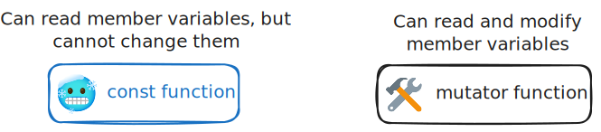
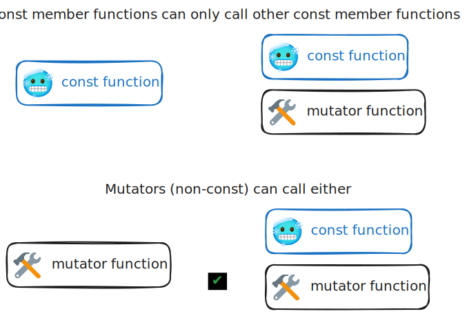

# Mutators, Accessors, and Constructors

Textbook sections:

- 1.4: Inline member functions
- 1.5: Mutators, accessors, and private helpers
- 1.6: Initialization and constructors

## Member functions review

We will be working on the following program:

```cpp
#include <iostream>

using namespace std;

class Rectangle
{
public:
    double GetArea();
    double GetPerimeter();
    void SetDimensions(double newWidth, double newHeight);
private:
    double width;
    double height;
};

double Rectangle::GetArea()
{
    return width * height;
}

double Rectangle::GetPerimeter()
{
    return 2 * (width + height);
}

void Rectangle::SetDimensions(double newWidth, double newHeight)
{
    width = newWidth;
    height = newHeight;
}

int main()
{
    Rectangle rec1;
    Rectangle rec2;

    rec1.SetDimensions(5.0, 4.0);
    rec2.SetDimensions(7.0, 5.0);

    cout << "Rectangle 1: " << endl;
    cout << "Area: " << rec1.GetArea() << endl;
    cout << "Perimeter: " << rec1.GetPerimeter() << endl;

    cout << endl;

    cout << "Rectangle 2: " << endl;
    cout << "Area: " << rec2.GetArea() << endl;
    cout << "Perimeter: " << rec2.GetPerimeter() << endl;

    return 0;
}
```

Review:

- Member variables
- Member functions
- Private vs public

## Mutators and accessors

- Mutator: a member function that can modify class member variables.
  - Example: `SetRadius()`
- Accessor: a member function that reads class member variables, but does not modify them.
  - Example: `GetArea()`

### Constant member functions

You can mark functions as `const` to tell the compiler that function should be an accessor (i.e., it should not modify any member variables). The compiler assumes a function is going to be a mutator unless told otherwise.



Make the `GetArea()` function constant by adding `const` at the end of the function declaration.

```
class Rectangle
{
public:
    double GetArea() const;
    // ...
};
```

You also must add `const` to the end of the function definition as well.

```
double Rectangle::GetArea() const
{
    return width * height;
}
```

#### Exercise: Make `GetPerimeter()` constant

Repeat the same steps and make `GetPerimeter()` constant.

#### Exercise: Observe the consequences of `const` member functions

- Make the `SetDimensions()` member function `const`. Try to build and run the program. What happens and why?
- Revert the change and keep `SetDimensions()` as a mutator.

### Calling other member functions



#### Exercise: Add a `MakeSquare()` member function.

- Create a public member function `MakeSquare()` as part of the `Rectangle` class.
- The `MakeSquare()` function should pick the smallest of the two dimensions (width and height) and then call `SetDimensions()` to make the rectangle into a square.
- Make the `MakeSquare()` function `const`. Try to build and run the program. What happens and why?

Why is marking member functions as `const` useful? Why couldn't the compiler detect this automatically for us?

## Constructors

Constructors are special member functions that are called when an object is created. A default constructor has no parameters.

Example declaration:

```
class Rectangle
{
public:
    Rectangle();
    // ...
};
```

Example definition:

```
Rectangle::Rectangle()
{
    width = 0;
    height = 0;
}
```

Constructor gets called automatically when a variable is created using the class as a data type.

```
Rectangle rec1;
```

## Additional exercises

### Questions: general questions

- What is the purpose of a constructor?
- How many parameters does a default constructor have?
- What limitations does a `const` member function have?
- When does a constructor get called?

### Questions: `const` member functions

Consider the following class:

```
class Foo
{
public:
    Foo();
    void Go();
    int Read() const;
    int Calculate() const;
    float Update(int num);
};
```

- Can the `Go()` function call the `Read()` function?
- Can the `Read()` function call the `Go()` function?
- Can the `Update()` function call the `Go()` function?
- Can the `Calculate()` function call the `Update()` function?
- Why/why not?

### Question: `const` parameters

A `const` parameter is slightly different than a `const` member function.

```
void DoSomething(const int& x);
```

In this example, can the value of `x` be modified by the `DoSomething` function? Why or why not?

### Exercise: constructors

Add a constructor to the `Circle` class from the previous lecture notes. Use it to initialize the radius to 0.
