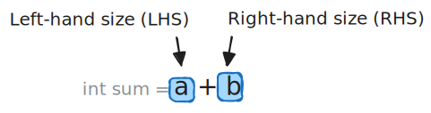
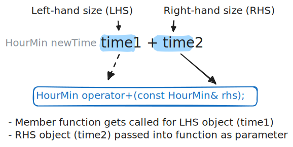
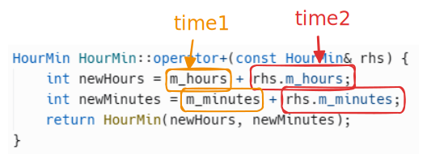

# Operator Overloading

Textbook sections:

- 1.10 Operator overloading
- 1.11 Overloading comparison operators

## Arithmetic operators

Example arithmetic operators (more examples [here](https://en.cppreference.com/w/cpp/language/operator_arithmetic)):

```cpp
int a = 2;
int b = 3;
int sum = a + b; // Addition operator
int sub = a - b; // Subtraction operator
int mul = a * b; // Multiplication operator
int div = a / b; // Division operator
```

An operator has a left-hand side (LHS) and a right-hand side (RHS).



## Arithmetic operator overloading

Consider this code:

```cpp
string a = "Hello ";
string b = "World";
string sum = a + b; // Addition operator
```

This works because the `string` class provides an _operator overload_ for the addition operator.

### HourMin class example

This `HourMin` class stores some number of hours and minutes. We'll expand this class further as we go.

```cpp
class HourMin {
public:
    HourMin();
    HourMin(int hours, int minutes);
    void IncrementHour();
    void Print() const;
private:
    int m_hours;
    int m_minutes;
};

HourMin::HourMin() {
    m_hours = 0;
    m_minutes = 0;
}

HourMin::HourMin(int hours, int minutes) {
    m_hours = hours;
    m_minutes = minutes;
}

void HourMin::IncrementHour() {
    m_hours++;
}

void HourMin::Print() const {
    cout << m_hours << ":" << m_minutes << endl;
}
```

Example use of this class:

```cpp
HourMin time1(3, 45);
HourMin time2(1, 5);
time1.Print();
time2.Print();
```

What if we want to add two time objects together using the addition operator?

```cpp
HourMin newTime = time1 + time2;
newTime.Print();
```

- This doesn't work yet - need to implement our own operator overload.

### Addition operator overload example

An operator overload is just a special member function. It has a special name.

```cpp
HourMin operator+(const HourMin& rhs);
```

Example of how you would normally call this member function:

```cpp
HourMin newTime = time1.operator+(time2);
newTime.Print();
```

Since we used the special member function name, C++ lets us use the addition operator to do the same thing:

```cpp
// These do the exact same thing!
HourMin newTime = time1.operator+(time2);
HourMin newTime = time1 + time2;
```

Pay attention to the role of the LHS and RHS objects. In this example, `time1` is on the left side (LHS) and `time2` is on the right (RHS).



The last step is to implement the overload member function definition. You can write whatever code you want in here to satisfy the requirements of the class. For the `HourMin` class, we'll keep it simple:

- Add the hours of the two objects together.
- Add the minutes of the two objects together.
- Return a new `HourMin` object using the computed hours and minutes.

```cpp
HourMin HourMin::operator+(const HourMin& rhs) {
    int newHours = m_hours + rhs.m_hours;
    int newMinutes = m_minutes + rhs.m_minutes;
    return HourMin(newHours, newMinutes);
}
```

How do we correlate this back to the `time1` and `time2` objects from our previous example code?

- The LHS object (`time1` in this example) is the object whose member function is being called.
- The RHS object (`time2` in this example) is the object passed into the member function.



### Discussion

Does the order of the LHS or RHS objects make a difference when using the addition operator? In other words, is `time1 + time2` the same as `time2 + time1`?

When should you overload the addition operator? Should every class overload the addition operator?

### Exercise: Overload the subtraction operator

Overload the subtraction operator for the `HourMin` class.

## Comparison operators

What if you want to check if two `HourMin` objects are equal?

```cpp
if (time1 == time2) {
    cout << "Equal" << endl;
}
```

Equality operator overload declaration:

```cpp
bool operator==(const HourMin& rhs);
```

- Similar to previous example, but this time returning a `bool`.

### Exercise: Implement equality overload

Implement the definition of the equality overload member function.

### Exercise: Overload the less-than operator

Overload the `<` operator.

## Additional exercises

### Question: Overload usage example

What is the value of the member variables in `newTime` after the following code executes?

```cpp
HourMin time1(1, 43);
HourMin time2(4, 78);
HourMin newTime = time1 + time2;
```

- `newTime.m_hours` is **\_\_\_\_**.
- `newTime.m_minutes` is **\_\_\_\_**.

### Exercise: Implement other operator overloads

Expand the `HourMin` class with additional overloads:

- Overload the `>`, `<=`, and `>=` operators.
- Overload the `!=` operator.

### Challenge: Update `HourMin` behavior

Change the `HourMin` class to only store a total number of minutes internally.

- Remove the `m_hours` member variable.
- Keep the constructor parameters the same. Consumers can still create `HourMin` objects by specifying a number of hours and minutes.
- Update the constructors to properly initialize the total number of minutes.
- Update the `Print` function to output output the number of hours and minutes (i.e., convert the total minutes into a breakdown of `hours:minutes`).
