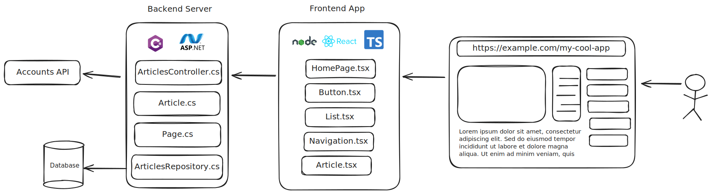

# Unit Testing

Textbook sections:

- 1.12 Separate files for classes
- 1.13 Unit testing (classes)

Clone the [exercise-unit-testing](https://github.com/eu-cpsc211/exercise-unit-testing) repository to your computer and make sure you can build it before class.

## CMake

C++ build tool we use in this class.

- Not a compiler.
- Generates project and configuration files for whatever compiler you are using.

You don't have to know the details of CMake, but be aware of its existence.

## Multiple source files

As programs get more complicated, you will want to split code out into separate files. When writing classes, a common pattern is:

- Header file with `.h` extension containing class definition.
- Source file with `.cpp` extension containing class member function definitions.
- Each class has its own pair of `.h` and `.cpp` files.

When we set up the CMake project, we tell it what source files to compile. It's possible to create multiple applications (executable files) that share source code files.


## Testing

Question: What is software testing and why should we do it?

### System complexity

Software systems can be complex.

Very simplified example web application diagram:



G1000 flight deck:


Very simplified embedded systems diagram:


How do we test complex systems like this?

### Types of tests

Test categories:

- **Unit testing:** tests small, isolated blocks of code like functions or classes.
- **Integration testing:** tests different parts of a system to ensure they work together as intended.
- **System testing:** tests the software application as a whole.
- **End-to-end (E2E) testing:** similar to system testing; tests a software product from a user's perspective; verifies all parts of a product work together as intended, including front-end UI, back-end code, network infrastructure, databases, etc.
- **Regression testing:** the process of running the other types of tests to verify no old functionality was broken by a new change.
- **Acceptance testing:** clients/stakeholders verify the software behaves as expected and meets their requirements.

Methods of execution:

- **Manual:** human manually executes test steps and verifies results.
- **Automatic:** test software executes test steps and verifies results.

Testing approaches:

- **White-box testing:** testing based on a knowledge of the implementation and knowledge of the source code.
- **Black-box testing:** testing based on inputs and expected outputs without knowledge of the source code.

For this class we are going to focus on unit testing. We will use unit tests in all programming assignments.

## Unit testing

Unit tests can be written by creating a second application dedicated to testing alongside the actual application being built. The code in the testing application exercises the functions in whatever code is being tested.

Tests focus on different units of code. Usually they are broken down to tests individual classes and individual member functions within those classes.


### GoogleTest

_Clone the [exercise-unit-testing](https://github.com/eu-cpsc211/exercise-unit-testing) repository to your computer if you haven't already. We will use this repository for the following examples and exercises._

We will use [GoogleTest](https://google.github.io/googletest/) as our unit testing library. This makes it easy to write and execute unit tests.

### Writing tests

Simple test case:

```cpp
TEST(Sample, OneEqualsOne)
{
    ASSERT_EQ(1, 1);
}
```

An assertion is a statement that says, "I expect this to be true. If not, fail the test."

Other assert macros such as:

- `ASSERT_NE()` - not equal
- `ASSERT_GE()` - greater than or equal to
- `ASSERT_GT()` - greater than
- `ASSERT_TRUE()` - true
- etc. See also [GoogleTest Assertions Reference](https://google.github.io/googletest/reference/assertions.html).

Example using variables:

```cpp
TEST(Sample, VariablesAreEqual)
{
    int a = 1;
    int b = 1;
    ASSERT_EQ(a, a);
}

TEST(Sample, VariablesAreNotEqual)
{
    int a = 1;
    int b = 2;
    ASSERT_NE(a, a);
}

TEST(Sample, ALessThanB)
{
    int a = 1;
    int b = 2;
    ASSERT_LT(a, a);
}
```

General guidelines:

- Keep unit tests focused on one thing.
- Test a range of input values, including edge cases.
- Keep tests repeatable and predictable.

### `GetHeight()` tests

Test to verify the `GetHeight()` member function returns the correct height:

```cpp
TEST(GetHeight, ReturnsCorrectHeight)
{
    Rectangle r(0, 0, 10, 10);
    ASSERT_EQ(r.GetHeight(), 10);
}
```

Improved version:

```cpp
TEST(GetHeight, ReturnsCorrectHeight)
{
    Rectangle r(0, 0, 5, 10);
    ASSERT_EQ(r.GetHeight(), 10);
}
```

- Why is that better?

Add another test case. What if we create a rectangle using the default constructor?

```cpp
TEST(GetHeight, DefaultConstructor)
{
    Rectangle r;
    ASSERT_EQ(r.GetHeight(), 0);
}
```

### Exercise: `GetWidth()` tests

Implement test cases for `GetWidth()`.

### `GetArea()` tests

We can't feasibly test every possible input into our class. Instead, select a set of different values that covers different ranges of input. For example:

- Width and height different.
- Width and height equal.
- One input 0.
- Both inputs 0.
- Negative width (we could choose to make negative widths invalid, but we'll allow it).
- Negative height.

Example test for when width and height are different:

```cpp
TEST(GetArea, WidthAndHeightDifferent)
{
    Rectangle r(0, 0, 10, 5);
    ASSERT_EQ(r.GetArea(), 50);
}
```

- Test fails. Why?
- The function is not implemented yet! Go implement it and try again.
- Continue adding other test cases.

### Exercise: `GetPerimeter()` tests

Implement test cases for `GetPerimeter()`.

### Test case organization

There is a general pattern to a unit test case:

```cpp
TEST(GroupName, CaseName)
{
    // Arrange: setup variables and things needed for the test case

    // Act: trigger the function that is being tested

    // Assert: verify things happened as expected
}
```

- Sometimes the steps are combined, but they are still there.
- Sometimes there may be multiple asserts within a test case if you need to verify multiple things.
- The `GroupName` and `CaseName` can be whatever you want, they are used for organizing your tests. You can't repeat the same combination of `GroupName` + `CaseName` though.

The [GoogleTest Primer](https://google.github.io/googletest/primer.html) documentation has good notes and recommendations as well.

## Additional exercises

### General questions

- What is the difference between black-box and white-box testing?
- What is the difference between `ASSERT_EQ`, `ASSERT_NE`, and `ASSERT_GE`?

### Challenge: `IsIntersecting()` member function

Add an `bool IsIntersecting(const Rectangle& r)` member function to the `Rectangle` class. This function checks to see if two rectangles are intersecting.

Add appropriate unit tests. Remember to test a range of scenarios:

- Not intersecting.
- Intersecting from left/right/top/bottom edges.
- Completely inside.
- Exact same size.
- Negative width/height.
- One rectangle has a 0-sized dimension.
