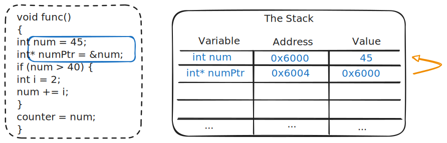
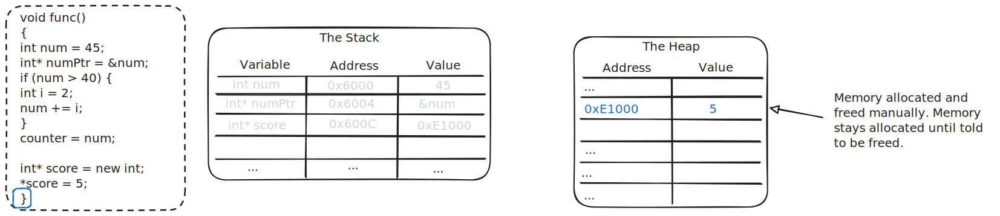

# Pointers

Textbook sections:

- 2.1 Pointers (General)
- 2.2 Memory regions: Heap/Stack

## Computer memory

You can think of memory as a big table of bytes.


Example with two variables:

```cpp
int num = 50;
double val = 12.34;
cout << num << endl;
cout << val << endl;
```


In this example:

- Compiler allocates memory for both `num` and `val` variables when function `Foo` is called.
- The amount of memory depends on the variable's data type.

Variables have two components:

- A memory address (the starting address in memory where the variable is stored).
- A value (the current value of the variable).

We don't know what the memory addresses will be ahead of time and we don't need to know.

## Pointer variables

A pointer variable is a variable that stores a memory address. A pointer variable specifies what data type it points to.

```cpp
int* numPtr; // A pointer to an int
double* dblPtr; // A pointer to a double
```

You can get the address of any variable by using the `&` operator in front of the variable's name.

```cpp
int num = 50;
int* numPtr = &num; // Get the address of num and store it in numPtr.
cout << numPtr << endl;
```

Example diagram of a pointer in action and the corresponding memory usage:


You can _dereference_ a pointer to access the memory location it points to. Use `*` in front of the variable name to dereference it. You can then read or write to that location like a normal variable.

```cpp
int* numPtr = &num;
cout << "numPtr (value): " << numPtr << endl;
cout << "numPtr (dereference): " << *numPtr << endl;
```

### Null pointers

A pointer can point to nothing (a memory address of 0):

```
int* p = 0;
int* p = nullptr;
int* p = NULL;
```

### Exercise: Pointer basics

Finish the following code:

```cpp
double temp = 98.6;
short day = 8;

// TODO: Create a pointer variable named "tempPtr" that points to "temp"
// <Your variable here>
cout << "temp (value): " << temp << endl;
cout << "temp (address): " << _________ << endl; // Replace blanks with the correct code
cout << "tempPtr (value): " << tempPtr << endl;
cout << "tempPtr (dereference): " << _________ << endl;

// TODO: Create a pointer variable named "dayPtr" that points to "day"
// <Your variable here>
cout << "day (value): " << day << endl;
cout << "day (address): " << _________ << endl;
cout << "dayPtr (value): " << dayPtr << endl;
cout << "dayPtr (dereference): " << _________ << endl;
```

### Assigning values through a pointer

You can assign a value to a dereferenced pointer:


Example:

```cpp
*tempPtr = 100.4;
*dayPtr = 9;
cout << "temp (value): " << temp << endl;
cout << "day (value): " << day << endl;
```

### Exercise: Reading pointer code

What is output by the following code?

```cpp
int a = 70;
int* z;
z = &a;
cout << *z << endl;

*z = 50;
cout << a << endl;
```

## Dynamic memory allocation

General discussion about memory organization:


There are different segments of main memory used for your program:

- Code: the machine instructions of your program.
- Data: static and global variables.
- Stack: a block of memory assigned to the program by the operating system for use while it runs.
- Heap: memory managed by the operating system from which a program can request additional memory from.

Local variables are stored on the stack. The compiler manages the allocation of this memory automatically.

Example: program enters function:



Example: variable in nested scope encountered:


When a variable goes out of scope, that memory is free/reclaimed:


You can allocate additional memory from the heap by using the C++ `new` keyword. This returns a pointer to the newly allocated memory. When you are done with the memory, you must free it with the `delete` keyword.


If you forget to free the memory, the OS does not allow it to be used elsewhere until the program is terminated.



Example of allocating and freeing memory dynamically:

```cpp
int* score = new int; // Allocate an integer in the heap and get a pointer to it

cout << "score (value): " << score << endl;
cout << "score (dereference): " << *score << endl;
cout << "----" << endl;

*score = 100;

cout << "score (value): " << score << endl;
cout << "score (dereference): " << *score << endl;
cout << "----" << endl;

delete score; // Free the memory we allocated
score = nullptr; // Set pointer to null since we freed that memory
```

### Exercise: `new`

What is output by the following code?

```cpp
int a = 70;
int* b = new int;
*b = 9;
cout << *b << endl;
cout << a << endl;

int* c = b;
*c = 12;
cout << a << endl;
cout << *b << endl;
cout << *c << endl;
```

## Study guide

- How do you declare a pointer variable?

- How do you dereference a pointer variable?

- How do you get the address of a variable (i.e., what is the "address-of" operator)?

- What are three valid ways of assigning a pointer variable to point to nothing/null?

- What is displayed by the following code?

```cpp
double alpha = 908;
double* p;
p = &alpha;
cout << *p << endl;
cout << alpha << endl;
```

- What is displayed by the following code?

```cpp
int num;
int* a;

a = new int;
*a = 88;
num = *a;
*a = 40;

cout << num << endl;
cout << *a << endl;
```

- What is displayed by the following code?

```cpp
int* a;
int* b;
int c;

b = &c;
a = b;

*a = 1;
b = new int;
*b = 2;
c = 3;

cout << *a << endl;
cout << *b << endl;
cout << c << endl;
```
