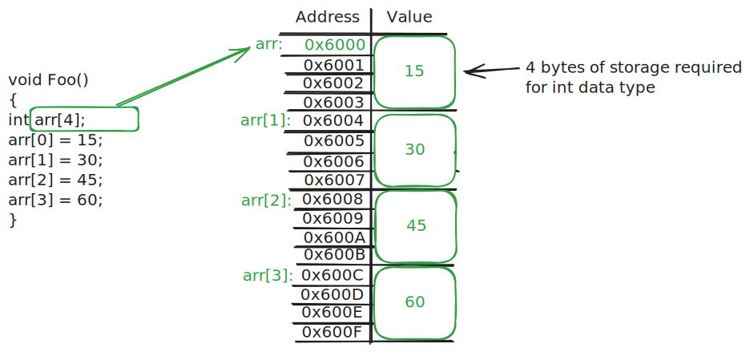
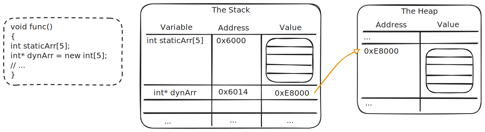
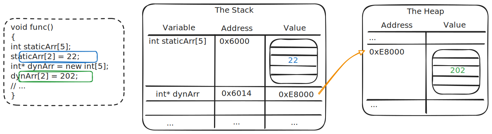
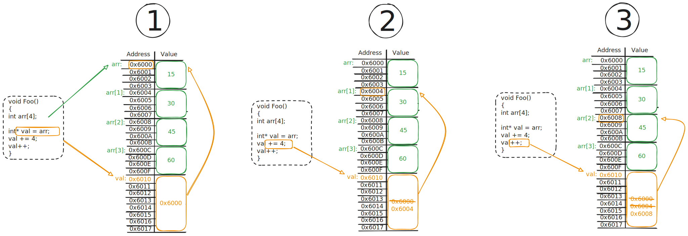
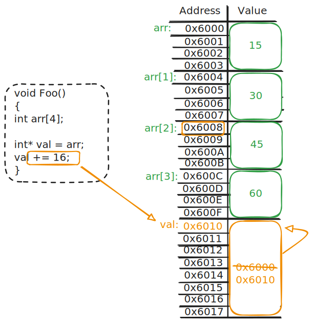
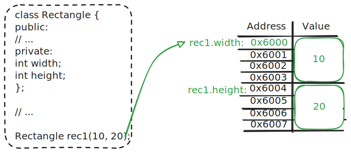
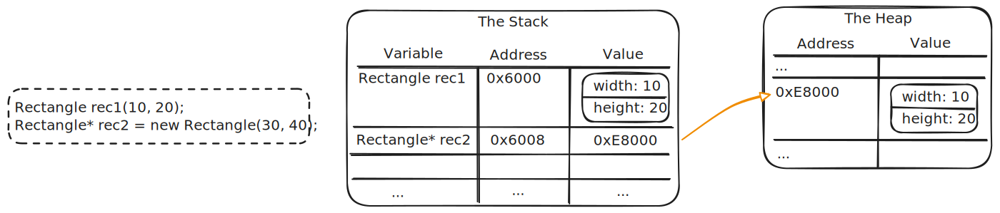

# Dynamic arrays and objects

Textbook sections:

- 2.3 Pointers and dynamically allocated arrays
- 2.4 Changing the size of a dynamically allocated array
- 2.5 Dynamically allocating objects

## Arrays

Static array review:

```
int arr[4];
```

- Memory for entire array allocated up front.
- Number of bytes in memory required for array: (size of each element \* number of elements).
- Subscript operator `[]` accesses element at specified index: (size of each element \* index).



### Static array: fixed size

When required array size is known up front:

```cpp
#include <iostream>

using namespace std;

const int NUM_SCORES = 5;

int main()
{
    int score[5];

    for (int i = 0; i < NUM_SCORES; i++) {
        cout << "Enter a score for game " << i + 1 << ": ";
        cin >> score[i];
    }

    cout << "Scores: ";
    for (int i = 0; i < NUM_SCORES; i++) {
        cout << score[i] << " ";
    }

    return 0;
}
```

### Static array: logical vs physical

When a maximum number of elements is determined up front:

```cpp
#include <iostream>

using namespace std;

const int MAX_SCORES = 50;

int main()
{
    int score[MAX_SCORES];
    int numScores = 0;

    cout << "How many scores do you want to enter? ";
    cin >> numScores;

    // TODO - Make sure that numScores is in range [0, MAX_SCORES]

    for (int i = 0; i < numScores; i++) {
        cout << "Enter a score for game " << i + 1 << ": ";
        cin >> score[i];
    }

    cout << "Scores: ";
    for (int i = 0; i < numScores; i++) {
        cout << score[i] << " ";
    }

    return 0;
}
```

### Dynamic array

Can use the `new` keyword to allocate an array on the heap with the exact size required.



In the diagram above:

- `staticArr` is allocated on the stack.
- `dynArr` is a pointer variable on the stack, but points to an array allocated on the heap.

When you are done with a dynamically allocated array, you must use `delete[]`. This is slightly different than when dealing with dynamic variables/objects. See the example code below.

Example code dynamically allocating an array:

```cpp
#include <iostream>

using namespace std;

int main()
{
    int numScores = 0;
    cout << "How many scores do you want to enter? ";
    cin >> numScores;

    // TODO - Make sure that numScores is a reasonable range (not negative)

    int* scores = new int[numScores];

    for (int i = 0; i < numScores; i++) {
        cout << "Enter a score for game " << i + 1 << ": ";
        cin >> scores[i];
    }

    cout << "Scores: ";
    for (int i = 0; i < numScores; i++) {
        cout << scores[i] << " ";
    }

    delete[] scores; // Clean up array memory
    scores = nullptr; // Set pointer to null since we freed the memory

    return 0;
}
```

Accessing array slots with a pointer to an array is the exact same as a regular array variable.



### Pointer math

Pointer that points to an array:

```cpp
int values[] = {1, 2, 3, 4, 5};
int *p = values;
```

Pointer to an integer doesn't know it's pointing to an array.

```
cout << *p << endl; // Gets whatever single integer is pointed to
```

Pointer math: modifying a pointer variable's memory address to change what is being pointed to.



1. Assigning pointer to beginning of the array.
2. Adding four bytes to pointer's value. Each element of the array is an `int`, which is four bytes.
3. Using the increment operator to advance to the next element. C++ knows how to do the math automatically.

Example code:

```cpp
int values[] = {1, 2, 3, 4, 5};
int *p = values;
cout << *p << endl;

p++;
cout << *p << endl;

p++;
cout << *p << endl;

p--;
cout << *p << endl;
```

Be very careful - don't wind up pointing somewhere you don't expect!

Example pointing beyond the end of the array:



## Resizing an array

- Allocate a new array.
- Copy items from old array to new array.
- Delete the old array.
- Update pointers.

Example code:

```cpp
#include <iostream>

using namespace std;

int main()
{
    // Create an array of scores
    int numScores = 5;
    int* scores = new int[5];
    scores[0] = 100;
    scores[1] = 75;
    scores[2] = 10;
    scores[3] = 87;
    scores[4] = 99;

    // Have user enter a new array size
    int newNumScores;
    cout << "Enter new array size: ";
    cin >> newNumScores;

    // Create a new array using the new size
    int* newScores = new int[newNumScores];

    // Initialize new array
    for (int i = 0; i < newNumScores; i++) {

        // Copy items from old array. An new items are initialized to 0.
        if (i < numScores) {
            newScores[i] = scores[i];
        }
        else {
            newScores[i] = 0;
        }
    }

    // Delete the old array
    delete[] scores;

    // Assign the new array to the old pointer
    scores = newScores;
    numScores = newNumScores;
    newScores = nullptr;

    // Print out the new array
    cout << "Scores: ";
    for (int i = 0; i < numScores; i++) {
        cout << scores[i] << " ";
    }

    // Cleanup
    delete[] scores;

    return 0;
}
```

## Dynamic object

Object creation review:



For local objects, the compiler allocates the necessary memory on the stack to store the object. Just like variables or arrays, we can also dynamically allocate an object on the heap and get a pointer to that object.



### Accessing members

- Regular object variable: use period `.` after variable name: `myObj.memberName`
- Pointer object variable: two options:
  - Dereference the pointer first, then access the member.: `(*myObjPtr).memberName`
  - Use the `->` operator to automatically dereference the pointer: `myObjPtr->memberName`

Example code:

```cpp
#include <iostream>

using namespace std;

class Thing {
  public:
    int id;
    int num;
};

int main()
{
    Thing t1;
    Thing* t2 = new Thing;

    t1.id = 1;
    t1.num = 100;

    // Invalid:
    // t2.id = 2;
    // t2.num = 200;

    (*t2).id = 2; // Dereference the pointer first, then access members
    (*t2).num = 200;

    t2->id = 3; // C++ provides shortcut that does the same thing
    t2->num = 300;

    return 0;
}
```

### Study guide

- Given a pointer `int* p`, how many bytes will `p++` increment the pointer by?
- Given a pointer `float* p`, how many bytes will `p--` decrement the pointer by?
- Given a pointer `double* p`, how many bytes will `p--` decrement the pointer by?
- What is the difference between a static array and a dynamic array?
- Given the following dynamic memory allocation, what is the proper way to deallocate that memory?

  ```cpp
  int* a = new int;
  ```

- Given the following dynamic memory allocation, what is the proper way to deallocate that memory?

  ```cpp
  Rectangle* r = new Rectangle;
  ```

- Given the following dynamic memory allocation, what is the proper way to deallocate that memory?

  ```cpp
  int* numbers = new int[100];
  ```

- What is displayed by the following program?

  ```cpp
  #include <iostream>

  using namespace std;

  class Thing {
  public:
      int number;
  };

  int main()
  {
      Thing *a, *b, *c;

      c = new Thing;
      c->number = 75;

      b = new Thing;
      b->number = c->number % 8;

      a = new Thing;
      a->number = b->number + c->number;

      cout << a->number << ' ' << b->number << ' ' << c->number << endl;

      return 0;
  }
  ```

- How do you access members of an object given a pointer to that object? (there are two ways; know both of them)
