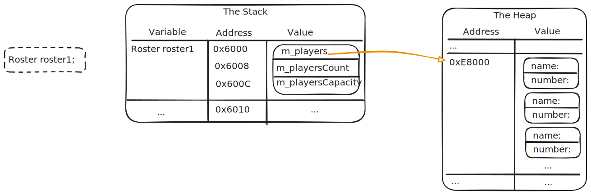
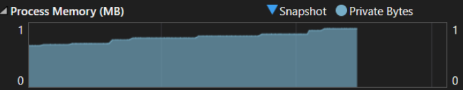
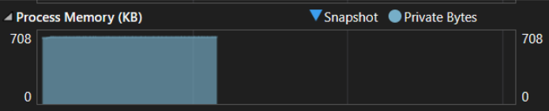

# Dynamic Members

Textbook sections:

- 2.6 Allocating arrays of objects
- 2.7 Classes with dynamically allocated data
- 2.8 Destructors
- 2.9 Memory leaks

## Dynamic class members

Consider the [Roster](../../examples/2-roster/main.cpp) class example. It uses a fixed-size array to store a list of players. We can make this class more robust and support a larger number of players using dynamic memory allocation. If a `Roster` object doesn't use a lot of players, we don't have to allocate as much memory.

To do this:

- Use a pointer member variable to store the memory address of the allocated array.
- Add a member variable to track the logical size of the array (how many players we've added to the roster).
- Add a member variable to track the physical size of the array (the current capacity of the array).



There are different options on how to manage the size of the array. For this example, if the array is full and a user tries to add another player, we will resize the array and increase its capacity by some fixed amount.

Example `Roster::AddPlayer()` function using dynamic memory allocation.

```cpp
void Roster::AddPlayer(string name, int number)
{
    // If array is full, resize it to add additional capacity
    if (m_playersCount == m_playersCapacity) {

        // Allocate new array with additional capacity
        Player* newPlayers = new Player[m_playersCapacity + PLAYER_BATCH_SIZE];

        // Copy existing players to new array
        for (int i = 0; i < m_playersCount; i++) {
            newPlayers[i] = m_players[i];
        }

        // Delete old array
        delete[] m_players;

        // Update pointer and capacity
        m_players = newPlayers;
        m_playersCapacity += PLAYER_BATCH_SIZE;
    }

    // Add new player to roster
    m_players[m_playersCount].name = name;
    m_players[m_playersCount].number = number;
    m_playersCount++;
}
```

## Memory leaks

There is something missing from the `Roster` class to complete the dynamic array allocation. To demonstrate this, we'll simulate using the `Roster` class over and over in a sample program.

```cpp
#include <chrono>
#include <thread>

// ...

int main()
{
    for (int i = 0; i < 100; i++) {
        Roster roster;
        roster.AddPlayer("Bob", 1);
        roster.AddPlayer("George", 10);
        roster.AddPlayer("John", 30);
        roster.AddPlayer("Bob", 1);
        roster.AddPlayer("George", 10);
        roster.AddPlayer("John", 30);

        // ...

        roster.Print();

        std::this_thread::sleep_for(500ms);
    }

    return 0;
}
```

We can use the profiling tools in Visual Studio to monitor the memory usage of the app over time.



As the program runs, the memory usage of the app increases, but never decreases. There is a memory leak in the code.

Memory leak:

- Memory is allocated for a program. The address to this memory is stored in a pointer (in our case, the `m_players` member variable).
- The program may use that memory for whatever purpose.
- The pointer variable at some point goes out of scope and no longer exists. No variable has any reference to the memory that was allocated previously.
- The operating system still thinks the program is using that memory, but it isn't.
- This memory has been "leaked".

To fix this, we need to free the memory we allocated - tell the operating system that we are no longer using it so the memory can be reclaimed and used elsewhere.

### Deleting memory

If you have a pointer to memory you allocated with `new`, you can free that memory with `delete`.

```cpp
// Allocate single integer
int* num = new int;

// Use as needed...

// Free when done
delete num;
```

Pointers to objects:

```cpp
// Allocate a single Player
Player* player = new Player;

// Use as needed...

// Free when done
delete player;
```

Arrays require you to use `delete[]`.

```cpp
// Allocate an array of Players
Player* players = new Player[5];

// Use as needed...

// Free when done
delete[] players;
```

## Destructors

When do we free memory in the `Roster` class? Free it when the object is destroyed. For that, use a destructor - a special member function that is called automatically when an object is destroyed (goes out of scope).

```cpp
Roster::~Roster()
{
    delete[] m_players;
}
```

- Only one destructor in a class.
- Use destructor to clean up any resources used by the class.
- See also: [RAII](https://en.wikipedia.org/wiki/Resource_acquisition_is_initialization)

With the destructor in place, this should fix the memory leak:



## Exercise: line drawing

See: https://github.com/eu-cpsc211/exercise-polyline

## Study guide

- When does a destructor get called?
- What is a memory leak?
