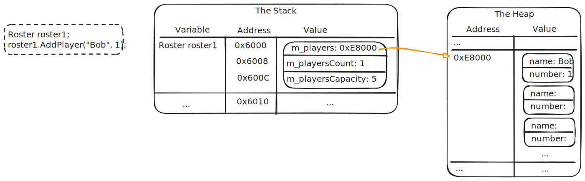
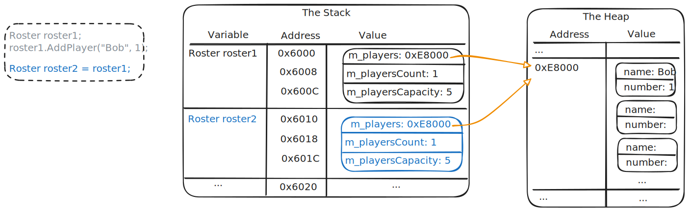
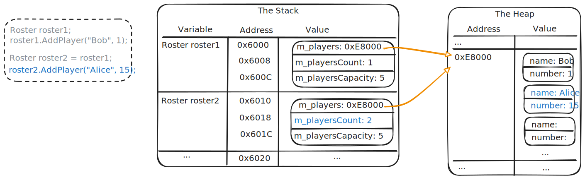
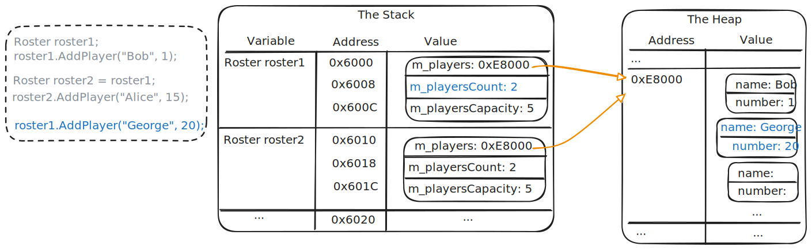
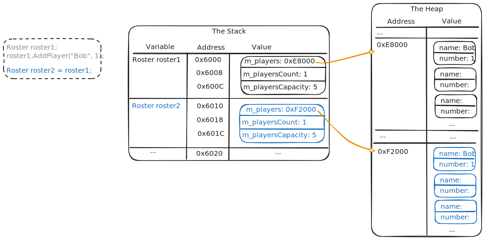
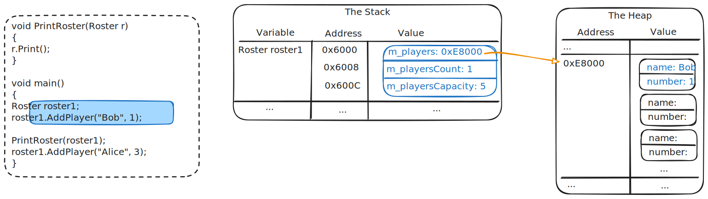
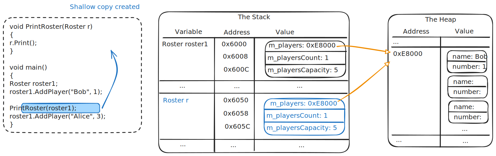
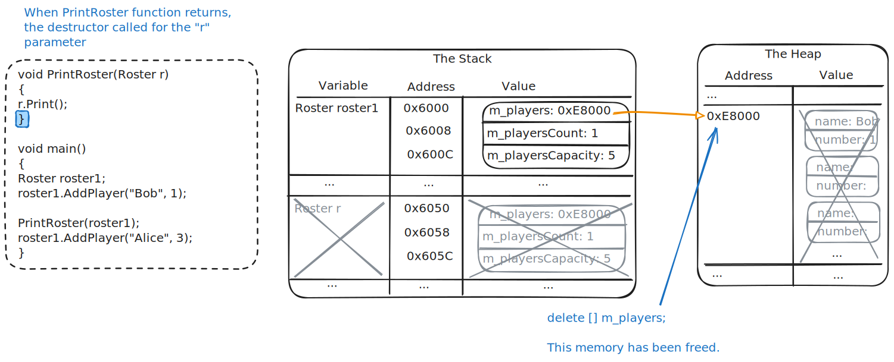

# Copying Objects

Textbook sections:

- 2.10 Copy constructors
- 2.11 Copy assignment operator
- 2.12 Rule of Three

## Shallow and deep copy

Shallow vs deep copy:

- Shallow copy: only immediate member variable values are copied. Pointer values remain the same.
- Deep copy: immediate member variable values are copied, but new memory is allocated for any sub-objects and pointers are updated.

Example of a shallow copy using the `Roster` class looked at previously:

```cpp
Roster roster1;
roster1.AddPlayer("Bob", 1);

// Start a new roster based off roster 1
Roster roster2 = roster1;
roster2.AddPlayer("Alice", 15);

// Update roster 1
roster1.AddPlayer("George", 20);

roster1.Print();
cout << endl;
roster2.Print();
```

Initial creation of `roster1`:



Creation of `roster2` (attempting to create a copy of `roster1`):



Add player to `roster2`:



Add player to `roster1`:



This is a shallow copy:

- `roster1` copied into `roster2`.
- Only copied the values of the member variables.
- Did NOT allocate new memory for `m_players` and create a copy of `roster1`'s players array.

Example of a deep copy:



- New array allocated for `m_players` in `roster2`.
- Player data from `roster1` copied into `roster2`.
- Other non-pointer member variables copied over.
- `roster2` now has an independent copy of the players array.

## Copy constructor

To do a deep copy, we can use a copy constructor.

Declaration:

```cpp
Roster(const Roster& other);
```

Definition:

```cpp
Roster::Roster(const Roster& other)
{
    m_players = new Player[other.m_playersCapacity];
    m_playersCount = other.m_playersCount;
    m_playersCapacity = other.m_playersCapacity;

    for (int i = 0; i < m_playersCount; i++)
        m_players[i] = other.m_players[i];
}
```

Calling:

```cpp
Roster newRoster = oldRoster;
// OR
Roster newRoster(oldRoster);
```

## Copy assignment operator

This code does not use a copy constructor:

```cpp
Roster newRoster;
newRoster = oldRoster;  // Copy assignment
```

Overload the assignment operator `=` to support deep copies.

Declaration:

```cpp
Roster& operator=(const Roster& rhs);
```

Definition:

```cpp
Roster& Roster::operator=(const Roster& rhs)
{
    // Don't assign to self
    if (this == &rhs) {
        return *this;
    }

    // Delete the array created by the default constructor
    delete[] m_players;

    // Copy members and allocate new array
    m_playersCapacity = rhs.m_playersCapacity;
    m_playersCount = rhs.m_playersCount;
    m_players = new Player[rhs.m_playersCapacity];

    // Copy array data over (deep copy)
    for (int i = 0; i < rhs.m_playersCount; i++)
        m_players[i] = rhs.m_players[i];

    return *this;
}
```

## Parameter passing by value

When an object is passed to a function by value, the copy constructor is called to create a copy of that object.

Example:

```cpp
void PrintRoster(Roster roster)
{
  roster.Print();
}

void main()
{
    Roster roster1;
    roster1.AddPlayer("Bob", 1);
    PrintRoster(roster1);

    roster1.AddPlayer("Alice", 3);
}
```

What happens if you don't implement a deep copy in this scenario:



Calling `PrintRoster` - `roster1` is passed by value, so a copy is created:



When an object goes out of scope, its destructor is called. The `Roster` destructor will free the memory for the `m_players` in the `r` object. But `roster1` is still using that array!



## Rule of three

If you are writing a class that dynamically allocates memory (i.e. uses `new`), then you will probably need to provide implementations of three functions:

- Destructor: to clean up and free the memory when the object is destroyed (don't want memory leaks).
- Copy constructor: to support properly copying objects during construction and passing by value.
- Copy assignment operator: to support `=` operator copying.

## Study guide

- Which constructor is called when an object is passed by value to a function?
- Write a copy constructor declaration for a class named `Thing`.
- If you create a class that dynamically allocates memory, what three functions are likely to be required?
- What is the difference between a deep copy and a shallow copy?
  - What happens to pointer member variables in both cases?
  - What happens to non-pointer member variables in both cases?
  - Given a class definition, be able to identify the default constructor, copy constructor, and assignment operator.

Consider the following code:

```cpp
class Person {
  public:
    Person();
    Person(const Person& other);
  private:
    int* m_numbers;
};

void main()
{
    Person oldPerson;
    Person newPerson = oldPerson;
    // ...
}
```

- If `Person` implements a **shallow copy**, what happens to `m_numbers`?
- If `Person` implements a **deep copy**, what happens to `m_numbers`?
