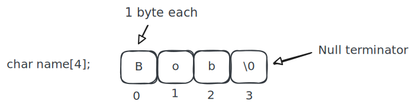
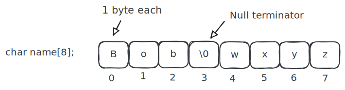
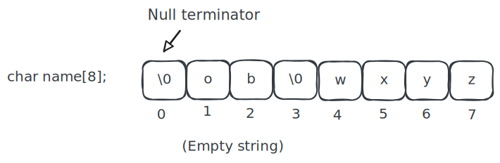

# C-Style Strings

Textbook sections:

- 2.13 String functions with pointers (Optional - recommended to read through, but we will cover what is needed to know for assignment in class)

## C-style string review

- C-style strings are null-terminated byte arrays.
- A null terminator is a numeric 0 value. It indicates the end of the string.
- i.e., an array of characters with null terminator at the end.



String does not have to full the buffer its stored in. The null terminator indicates where the string ends.



An empty string is where the beginning of the string is a null terminator. There are no characters in the string and it has a length of `0`.



## Creating C-style strings

Manual initialization:

```cpp
char message[6];
message[0] = 'B';
message[1] = 'o';
message[2] = 'b';
message[3] = 0;

cout << message;
```

With string literals:

```cpp
char message[6] = "Bob"; // Valid
message = "Alice";       // Not valid
```

With pointer to string literal:

```cpp
const char* message = "Hello";  // Valid
char* name = "Bob";             // Valid
name = "Alice";                 // Valid
```

## Dynamic string allocation

Can allocate a string buffer like any other dynamic array.

```cpp
// Determine buffer size
int bufferSize = 10;

// Allocate a string buffer
char* buffer = new char[bufferSize];

// Get input from user
cout << "Enter a string: ";
cin.getline(buffer, bufferSize);

// Print the string
cout << "You entered: " << buffer << endl;

// Clean up
delete[] buffer;
```

## String length

The length of a string is determine by how many characters are in the string before the null terminator. The string length does not include the null terminator.


In the example above:

- Buffer size: 8
- Logical array size: 4
- String length: 3

Can use `strlen()` to determine string length.

```cpp
#include <cstring>

// ...

// Get string length
int length = strlen(buffer);
cout << "Length: " << length << endl;
```

## Copying a string

Refer to the programming assignment documentation for the discussion on copying a string.

Example copy:

```cpp
// Create copy of string
int copySize = length + 1; // +1 for null terminator
char* copy = new char[copySize];

// Copy all bytes
memcpy(copy, buffer, copySize);

// Use copy as needed

// Clean up when done
delete[] copy;
```

## Comparing strings

Comparing strings using the `strcmp()` function:

```cpp
#include <cstring>

// ...

const char* a = "Hello";
const char* b = "Hello";
int result = strcmp(a, b);

cout << result << endl;
```

Output of `strcmp(a, b)`:

- `0` if the strings are equal.
- Negative integer if `a` is considered less than `b` (i.e. `a` comes before `b` alphabetically).
- Positive integer if `a` is considered greater than `b` (i.e. `a` comes after `b` alphabetically).

Example: what is the result of `strcmp()` here:

```cpp
char str1[50] = "zyx";
char str2[50] = "xyz";

strcmp(str1, str2);
```

Example: what is the result of `strcmp()` here:

```cpp
char str1[50] = "FFF";
char str2[50] = "GGG";

strcmp(str1, str2);
```

## Study guide

- What does `strlen()` return? Make sure to know the relationship between string length, buffer size, and the null terminator.
- What are the possible return values for `strcmp()` and what causes each value to be returned?
- How would you get the string length for the string buffer used in the following code? What value would it return?

  ```cpp
  int bufferSize = 15;
  char *buffer = new char[bufferSize];
  cin.getline(buffer, bufferSize);
  ```

- Come up with different values for `str1` and `str2` that would cause `strcmp` to return a negative value, a positive value, and a zero.

  ```cpp
  char str1[50] = "YOUR VALUE HERE";
  char str2[50] = "YOUR VALUE HERE";

  strcmp(str1, str2);
  ```
