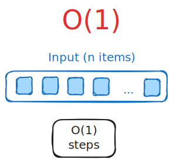
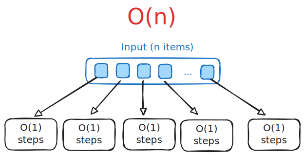
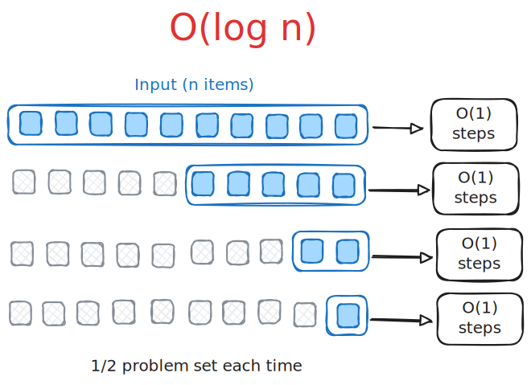
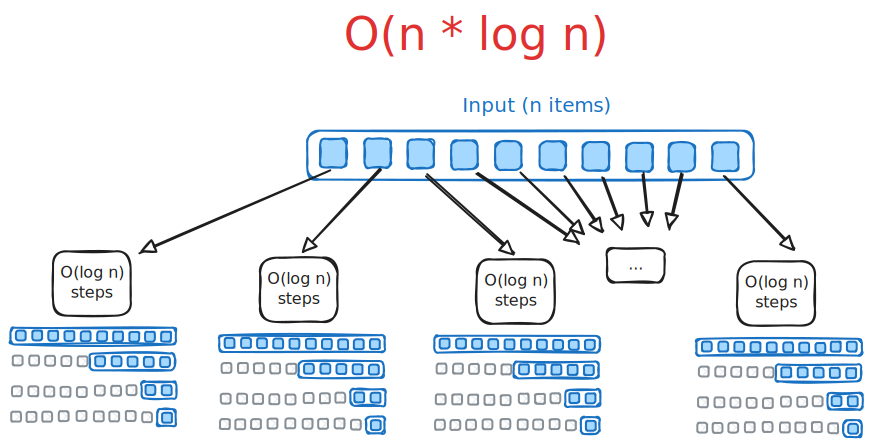
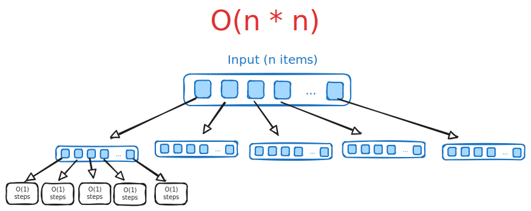

# Finding Big O

How to determine Big O of an algorithm?

- Start with algorithm steps (or code).
- Determine some formula $f(n)$ that models the number of steps required based on input size $n$.
- Drop constants and lower-order terms.
- (Don't need to find an exact $f(n)$.)

## Code constructs

The following examples show how to determine worst-case time complexity for various programming constructs. Assume the variable `n` is the problem size we are evaluating.

### Statements

For a block of statements, analyze each statement and add the complexities.

```cpp
int val = 543;                  // O(1)
int x = 12;                     // O(1)
num = (x * x) + (val / 32);     // O(1)

// Big O for all statements is O(1 + 1 + 1) = O(1)
```

### Function calls

Evaluate the complexity of the function being called.

```cpp
int val = 543;                  // O(1)
int x = 12;                     // O(1)
num = DoSomethingLinear(n);     // O(n) if O(DoSomethingLinear(n)) is O(n)
num = num * x + val;            // O(1)

// Big O for all statements is O(1 + 1 + n + 1) = O(n)
```

### Branches

Analyze each branch independently, then choose the one with the worst Big O.

```cpp
if (x > y) {                     // O(1)         boolean comparison
    y = x;                       // O(1)
    x++;                         // O(1)
}
else if (x == 2) {               // O(1)         boolean comparison
    DoSomethingQuad(n, x);       // O(n^2)
}
else {
    x = y;                       // O(1)
    DoSomethingLinear(n);        // O(n)
    DoSomethingLog(n);           // O(log(n))
}

// Big O for the entire if statement is O(1 + 1 + n^2) = O(n^2)
```

### Loops

Determine if the loop is regulated by problem size $n$, and by how much.

```cpp
for (int i = 0; i < n; i++) {
    cout << values[i] << endl;      // O(1)
}

// Total: O(n * 1) = O(n)       multiply complexity of loop body by number of iterations
```

Example with linear loop body:

```cpp
for (int i = 0; i < n; i++) {
    DoSomethingLinear(n, i);        // O(n)
}

// Total: O(n * n) = O(n^2)       loop iterates n times, each iteration is O(n)
```

Example with a linear operation within the condition check:

```cpp
for (int i = 0; i < n && DoSomethingLinear(n); i++) {    // O(n)
    cout << values[i] << endl;                           // O(1)
}

// loop iterates n times, each iteration is O(n + 1)
// Total: O(n * (n + 1)) = O(n^2 + 1n) = O(n^2)
```

### Nested loops

Both outer and inner loops are iterations of problem size $n$:

```cpp
for (int i = 0; i < n; i++) {
    for (int j = 0; j < n; j++) {
        DoSomethingConstant(n, i, j);    // O(1)
    }
}

// Outer loop: n times
// Inner loop: n times
// Inner loop body: O(1)

// Total: O(1) * n * n = O(1 * n * n) = O(n^2)
```

Sometimes loops are not dependent on the problem size at all:

```cpp
for (int i = 0; i < n; i++) {
    for (int j = 0; j < 3; j++) {
        DoSomethingConstant(n, i, j);    // O(1)
    }
}

// Outer loop: n times => O(n)
// Inner loop: 3 times => O(1)
// Inner loop body: O(1)

// Total: O(1) * 3 * n = O(1 * 3 * n) = O(3n) = O(n)
```

Sometimes loops depend on two input sizes:

```cpp
for (int i = 0; i < n; i++) {
    for (int j = 0; j < m; j++) { // "m" instead of "n" here
        DoSomethingConstant(n, i, j);  // O(1)
    }
}

// Outer loop: n times
// Inner loop: m times
// Inner loop body: O(1)

// Total: O(1) * O(m) * O(n) = O(1 * m * n) = O(n*m)
```

## Common growth rates

Below are examples of patterns you may see when dealing with algorithms falling into common growth rates.

### Constant

Constant time code doesn't change the required number of steps based on the problem size.

```cpp
int i = n - 1;
cout << i << endl;
cout << numbers[i] << numbers[i - 1] << numbers[i - 2] << endl;
```



### Linear

Loop that iterates over the set of inputs:

```cpp
for (int i = 0; i < n; i++) {
    DoSomethingConstant(i, n);
}
```

The loop does not have iterate _exactly_ `n` times. The loop is driven in a linear fashion by `n`. For example:

```cpp
for (int i = 0; i < n - 2; i++) {
    DoSomethingConstant(i, n);
}
```

Or:

```cpp
int i = 0;
while (i < n * 3) {
    DoSomethingConstant(i, n);
    i++;
}
```



### Logarithmic

Logarithmic complexity is harder to grasp than linear. If the input size is being dividing into smaller pieces consistently, then it's probably logarithmic (e.g., divide by 2, multiply by 3, etc.).

Example:

```cpp
for (int i = n; i > 0; i = i / 2) {
    DoSomethingConstant(i);
}
```

Example:

```cpp
int i = 1;
while (i < n) {
    DoSomethingConstant(i);
    i *= 2;
}
```



#### Logarithms nitty gritty

Here's a more detailed example of deriving $O(log \space n)$ from a loop.

Remember that:

> $log_b a=x$

Is the same as:

> $b^x = a$

Consider this code:

```cpp
for (int i = n; i > 0; i = i / 2) {
    DoSomethingConstant(i);                // O(1)
}
```

How many times does the loop execute?

`i` starts at `n` and is halved after each iteration.

> $i \div 2 \div 2 \div 2 ...$

This keeps going until `i` winds up at `1` - this is the last iteration of the loop.

> $i \div 2 \div 2 \div 2 ... = 1$

How many iterations are needed to reach the end? Consider an example where `n = 100`.

> $100 \div 2 \div 2 \div 2 \div 2 \div 2 \div 2=1$ (remember we're doing integer division)

There will be seven iterations of the loop in this example. We can rewrite the equation:

> $100 \div 2^6=1$

- Six divisions by two are required, thus $2^6$.

A generalized version of this is:

> $n \div 2^x=1$

- $x$ is one less than the number of loop iterations.
- $n$ is the input size.

Let's find $f(n)$. Remember, this is a formula that tells us how many steps are required by the loop being analyzed given some input size $n$.

> $f(n) = x$

- Each step in one iteration of the loop is $O(1)$.
- The loop iterates $x - 1$ times.
- So we can say the loop essentially requires $x$ steps (we can drop the constants).

We need to rewrite this in terms of $n$ instead of $x$. What is $x$?

> $\frac{n}{2^x}=1$

Can rewrite as:

> $n=2^x$

Can rewrite using a log:

> $log_2 n = x$

Substitute for $x$ back in $f(n)$:

> $f(n) = log_2 n$

Find Big O:

> $O(log \space n)$

### Linearithmic

Combination of linear and logarithmic. For each item in a list, you perform a logarithmic number of steps based on problem size `n`.

```cpp
for (int i = 0; i < n; i++) {
    for (int j = n; j > 0; j = j / 2) {
        DoSomethingConstant(i);
    }
}
```



### Quadratic

For each item in a list, you perform a linear number of steps based on problem size `n`.

```cpp
for (int i = 0; i < n; i++) {
    for (int j = 0; j < n; j++) {
        DoSomethingConstant(i);
    }
}
```

A function call may hide an inner linear operation:

```cpp
for (int i = 0; i < n; i++) {
    DoSomethingLinear(values, n, i);
}
```



### Cubic

Similar to quadratic, but three times instead of two:

```cpp
for (int i = 0; i < n; i++) {
    for (int j = 0; j < n; j++) {
        for (int k = 0; k < n; k++) {
            DoSomethingConstant(i);
        }
    }
}
```
