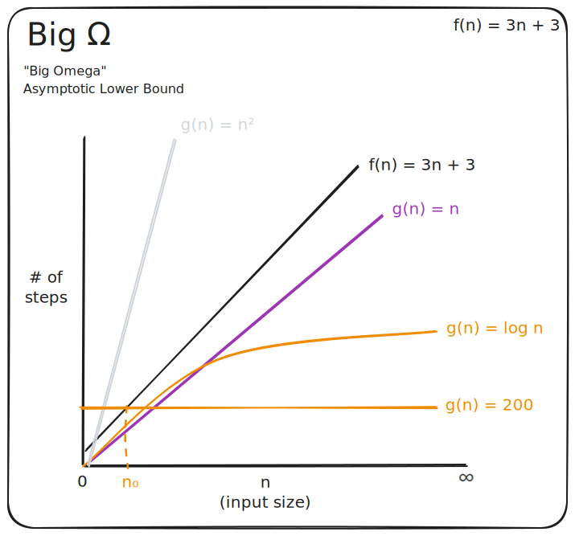

# Formal Definitions

## Big Ο

Formal definition:[^1]

> $O(g(n)) = \set{f(n) : \text{ there exists positive constants } c, n_0 \text{ such that } 0 \le f(n) \le cg(n) \text{ for all } n \ge n_0 } $

[^1]: Cormen, Thomas H.; Leiserson, Charles E.; Rivest, Ronald L. (2009). Introduction to Algorithms (3rd ed.). Cambridge/MA: MIT Press. p. 47. ISBN 978-0-262-53305-8.

Consider the `Find()` function we've been analyzing. The number of steps required by the algorithm in the worst case is represented by $f(n)=3n+3$. The input $n$ represents the input size.

Big Ο describes an asymptotic upper bound on the growth rate for $f(n)$ as the input size $n$ grows towards infinity. The number of steps required by `Find()` will not grow at a faster rate than some $cg(n)$ that fits the formal definition above.

Previously we said `Find()` is $O(n)$. Let's see if that holds to the formal definition.

- $f(n)=3n+3$ (this models the required number steps for the `Find()` function)
- $g(n)=n$ (this is our proposed $g(n)$)

Can we find a constant $c$ such that $f(n) \le cg(n)$?

- $c=1$ does not work: $3n+3 \gt 1n$
- $c=3$ does not work: $3n+3 \gt 3n$
- $c=4$ works: $3n+3 \le 4n$

Notice this only works due to the condition "for all $n \ge n_0$". In other words, we don't care about small input sizes. At some point, the input grows large enough for $3n+3 \le4n$ to be true.

- When $n=1$:
  - $3(1) + 3 > 4(1)$
  - $6 > 4$
- When $n=2$:
  - $3(2) + 3 > 4(2)$
  - $9 > 8$
- When $n=3$:
  - $3(3) + 3 \le 4(3)$
  - $12 \le 12$

Thus, $n_0=3$.

Given what has been established, we can say that $f(n)$ is a member of the set $O(n)$.

- $3n+3 \in O(n)$

Our assertion that `Find()` is $O(n)$ was correct. But there are a number of functions $g(n)$ that also satisfy the requirements.

Consider $g(n)=n^2$. Is there a constant $c$ such that $f(n) \le cg(n)$?

- $c=1$ works: $3n+3 \le 1n^2$

Thus, we can say that $f(n)$ is also a member of the set $O(n^2)$.

- $3n+3 \in O(n^2)$

We can also find examples of $g(n)$ that are not upper bounds for $f(n)$. Consider $g(n)=log \space n$. There is no constant $c$ that satisfies $f(n) \le cg(n)$. So, $f(n)$ is not a member of the set $O(log \space n)$:

- $3n+3 \notin O(log \space n)$

## Big Ω

Formal definition:[^2]

> $Ω(g(n)) = \set{f(n) : \text{ there exists positive constants } c, n_0 \text{ such that } 0 \le cg(n) \le f(n) \text{ for all } n \ge n_0 } $

[^2]: CLRS p. 48

Big Ω is the opposite of big Ο. Big Ο is an asymptotic upper bound; big Ω is an asymptotic **lower** bound. This will tell us that $f(n)$ will grow no slower than some $cg(n)$.

For example, we can use the same functions as before:

- $f(n)=3n+3$ (this models the required number steps for the `Find()` function)
- $g(n)=n$ (this is our proposed $g(n)$)

Is there a constant $c$ that satisfies $cg(n) \le f(n)$?

- $c=1$ works: $1n \le 3n+3$

We can say that $f(n)$ is a member of the set $Ω(n)$.

- $3n + 3 \in Ω(n)$

So, it turns out the `Find()` function is both $O(n)$ and $Ω(n)$. But, as with big Ο, there are multiple functions $g(n)$ that would work for this example.

Consider $g(n)=log \space n$. Is there a constant $c$ such that $cg(n) \le f(n)$?

- $c=1$ works: $1 \space log \space n \le 3n + 3$

Thus, we can say that $f(n)$ is also a member of the set $Ω(log \space n)$.

- $3n+3 \in Ω(log \space n)$

We can also find examples of $g(n)$ that are not lower bounds for $f(n)$. Consider $g(n)=n^2$. There is no constant $c$ that satisfies $cg(n) \le f(n)$. So, $f(n)$ is not a member of the set $Ω(n^2)$:

- $3n+3 \notin Ω(n^2)$

## Big Θ

Formal definition:[^3]

> $Θ(g(n)) = \set{f(n) : \text{ there exists positive constants } c_1, c_2, n_0 \text{ such that } 0 \le c_1g(n) \le f(n) \le c_2g(n) \text{ for all } n \ge n_0 } $

Big Θ is an asymptotically **tight** bound. It's a combination of Big Ο and Big Ω. If $f(n) \in O(g(n))$ and $f(n) \in Ω(g(n))$, then $f(n) \in Θ(g(n))$.

In other words, this will tell us that $f(n)$ will grow no slower than some $c_1g(n)$ and no faster than some $c_2g(n)$.

For example, we can use the same functions as before:

- $f(n)=3n+3$ (this models the required number steps for the `Find()` function)
- $g(n)=n$ (this is our proposed $g(n)$)

Are there constants $c_1$ and $c_2$ that satisfy $c_1 g(n) \le f(n) \le c_2 g(n)$?

- $c_1=1$ and $c_2=4$ work: $1n \le 3n+3 \le 4n$

We can say that $f(n)$ is a member of the set $Θ(n)$.

- $3n + 3 \in Θ(n)$

We can find examples of $g(n)$ that were upper or lower bounds, but are not tight bounds. For example:

- $3n+3 \notin Θ(n^2)$
- $3n+3 \notin Θ(log \space n)$

In informal discussions, it's common to use reference "big Ο" when "big Θ" would be more accurate, and to use equality instead of set notation. For example, we said the `Find()` function is modeled on $f(n)$ and $f(n) = O(n)$.

[^3]: CLRS p. 45.
