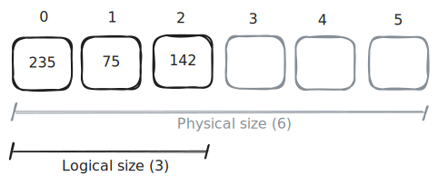
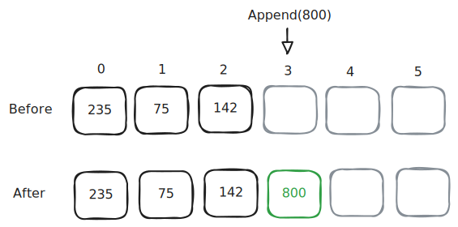
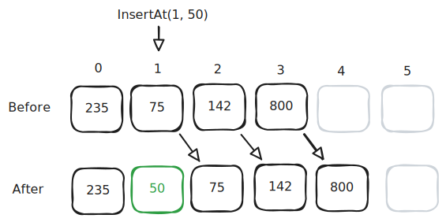
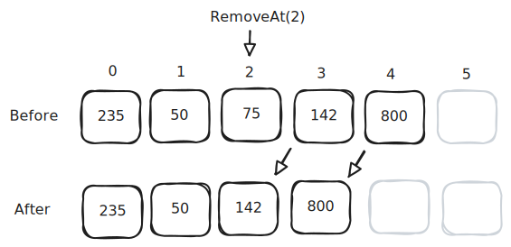
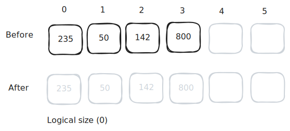

# Array Lists

Textbook sections:

- 4.1 List abstract data type (ADT)
- 4.2 Array-based lists

## List ADT

An abstract data type (ADT) specifies certain characteristics about a data type, but does not dictate the implementation details. The characteristics of a list ADT can vary, but usually look something like this:

- Has an ordered sequence of items (ordered, but not necessarily sorted).
- Can append, insert, and remove items.
- Can access an item at a specified index within the list.

You will be implementing a list ADT using two different data structures: an array and a linked list.

## Array lists



An array list uses an array to store each item of the list. As items are added to the list, they are stored in slots within the array.

- Physical size: the number of elements allocated in the array. Also known as _capacity_ or _max size_.
- Logical size: the number of items currently in the list. Also known as _size_ or _count_.

```cpp
int capacity = 10; // Physical size (max # of items)
int size = 0; // Logical size (current # of items)

int* items = new int[capacity];
```

Many array list implementations will dynamically resize the backing array to increase capacity as the list grows.

### Append



To add an item to the end of the list:

```cpp
items[size] = newItem;
size++;
```

You'll need to check if the array is full or not first:

```cpp
if (capacity == size) {
    // Array is full
}
```

### Insert



- Verify array isn't full.
- Shift existing items over.
- Assign new value.
- Increment size.

### Remove



- Shift remaining items over.
- Decrement size.

### Clear



Set logical size to 0.

```cpp
size = 0;
```

An array list that dynamically resizes the physical array may choose to reallocate the array to a smaller size to free unused memory.

## Study guide

### Code example 1

Assume the code below has just been executed when answering the following questions.

```cpp
int capacity = 52;
int size = 0;

int* items = new int[capacity];
items[size++] = 9;
items[size++] = 15;
items[size++] = 88;
items[size++] = 0;
```

- What is the physical size of the array?
- What is the logical size of the array?
- What C++ expression could be used to check if the array is full?
- What C++ expression could be used to check if the array is empty?
- What is the first value in the list?
- What is the last value in the list?

### Code example 2

Assume the code below has just been executed when answering the following questions.

```cpp
int capacity = 52;
int size = 0;

int* items = new int[capacity];
items[size++] = 9;
items[size++] = 15;
items[size++] = 88;
items[size++] = 0;

size--;
size--;
```

- What is the physical size of the array?
- What is the logical size of the array?
- What C++ expression could be used to check if the array is full?
- What C++ expression could be used to check if the array is empty?
- What is the first value in the list?
- What is the last value in the list?
