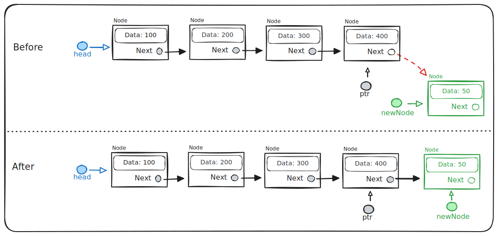
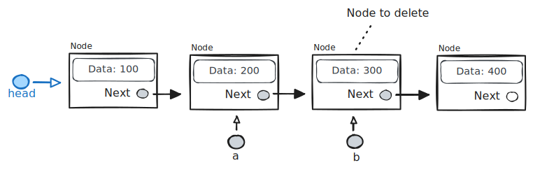

# Linked Lists

Textbook sections:

- 4.3 Singly-linked lists
- 4.4 Singly-linked lists: Insert
- 4.5 Singly-linked lists: Remove

## Linked list

A linked list connects multiple elements together via pointers. Each element is an object. You may here elements in a linked list referred to as _nodes_.

Here is an example class for a node in a linked list:

```cpp
class Node {
  public:
    int data;
    Node* next;
};
```

This class can contain whatever data you want, but will need a `next` pointer that points to the next node in the list. These are what link the nodes together.

A linked list starts with a pointer to the first node. This is the _head_ pointer.


The last node in the list has a `next` pointer of `NULL`.

### Prepend


- Allocate a new node.
- Point new node to the head node.
- Update head node pointer to new node.

### Insert


- Allocate a new node.
- Get a pointer to the node you want to insert after.
- Update `next` pointers so the new node is part of the list.

### Remove


- Get a pointer to the node in front of the node you are going to delete.
- Update `next` pointers to exclude the old node from the list.
- Delete the old node to free its memory.

### Append



- Allocate a new node.
- Get a pointer to the last item in the list.
- Update `next` pointers so the new node is part of the list.

Sometimes it is useful to keep a `tail` pointer around (alongside the `head` pointer) that always points to the last node in the list.

## Exercise: polyline

See: https://github.com/eu-cpsc211/exercise-polyline-linked-list

## Study guide

### Code example 1

Assume the code below has just been executed when answering the following questions.

```cpp
class Node {
  public:
    int data;
    Node* next;
}

int main()
{
    Node* head;
    head = new Node();
    head->data = 99;
    head->next = NULL;

    Node* ptr;
    ptr = new Node();
    ptr->data = 50;
    ptr->next = head;
    head = ptr;

    ptr = new Node();
    ptr->data = 136;
    ptr->next = head;
    head = ptr;

    // ...
}
```

- What is the correct order of all data values in the linked list?

- What would be output by each of the following statements?

  - `cout << head->data << endl;`
  - `cout << head->next->data << endl;`
  - `cout << head->next->next->data << endl;`
  - `cout << ptr->data << endl;`
  - `cout << ptr->next->data << endl;`

- What would the following code print?

  ```cpp
  while (ptr != NULL) {
      cout << ptr->data << " ";

      if (ptr->next != NULL)
          cout << ptr->next->data << " ";

      ptr = ptr->next;
  }
  ```

### Code example 2

Assume the code below has just been executed when answering the following questions.

```cpp
class Node {
  public:
    int data;
    Node* next;
}

int main()
{
    Node* head;
    head = new Node();
    head->data = 99;
    head->next = new Node();

    Node* ptr = head->next;
    ptr->data = 50;
    ptr->next = new Node();
    ptr = ptr->next;

    ptr->data = 136;
    ptr->next = NULL;

    // ...
}
```

- What is the correct order of all data values in the linked list?

- What would be output by each of the following statements?

  - `cout << head->data << endl;`
  - `cout << head->next->data << endl;`
  - `cout << head->next->next->data << endl;`
  - `cout << ptr->data << endl;`
  - `cout << ptr->next->data << endl;`

- What would the following code print?

  ```cpp
  while (ptr != NULL) {
      cout << ptr->data << " ";

      if (ptr->next != NULL)
          cout << ptr->next->data << " ";

      ptr = ptr->next;
  }
  ```

### Operations examples

- Consider the following linked list. Write two lines of C++ code that would remove `b` from the list.



- Consider the following linked list. Write two lines of C++ code that would insert `newNode` into the linked list after the `head` node (i.e., the new node will be the second item in the list).


- Consider the following function `Append()`. Implement the function so the node pointed to by `newNode` is appended to the end of the list. The `head` pointer points to the first node in the list.

```cpp
void Append(Node* head, Node* newNode)
{
    // TODO
}
```
