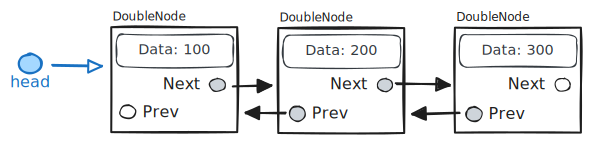
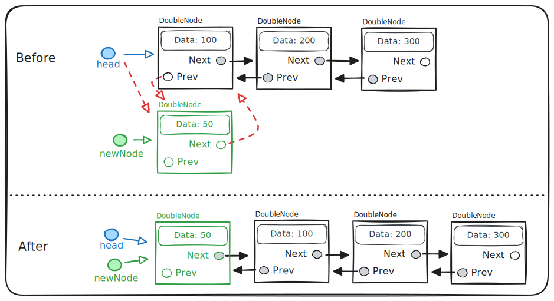
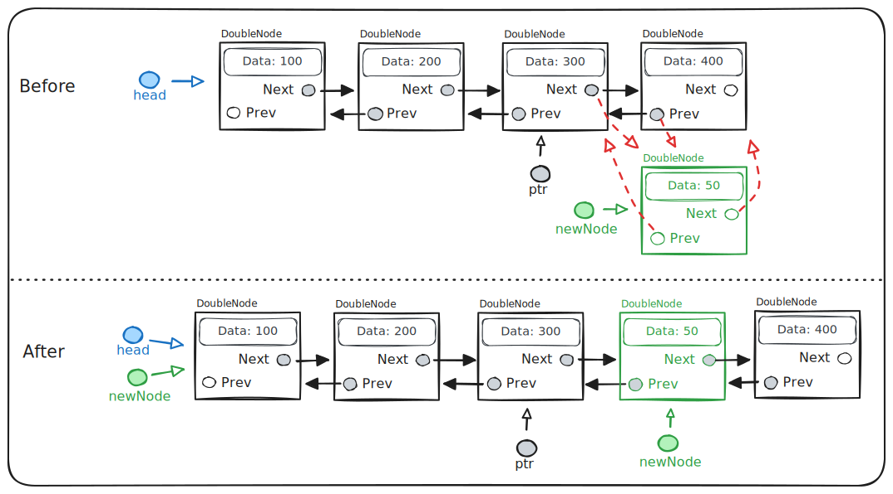
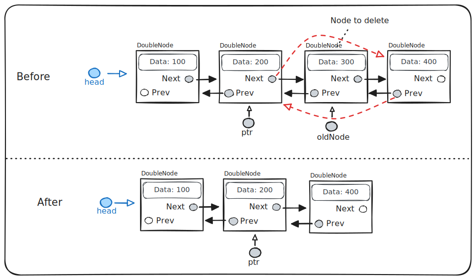
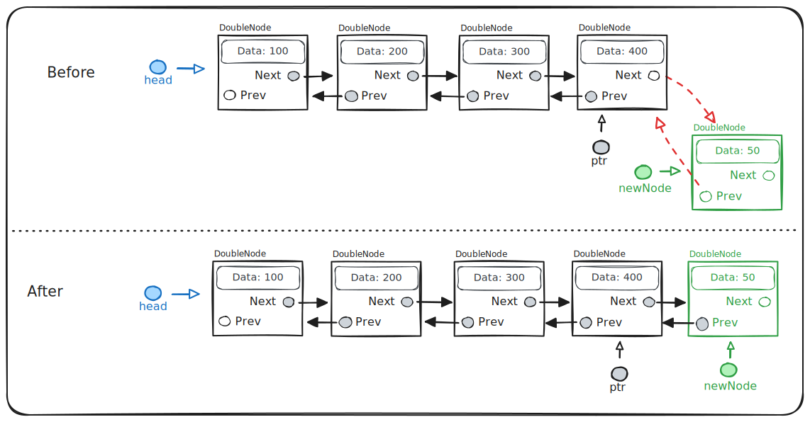
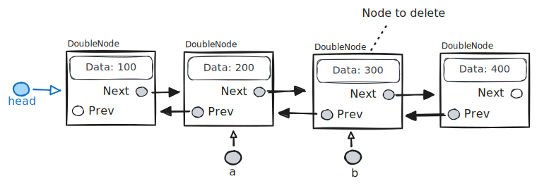
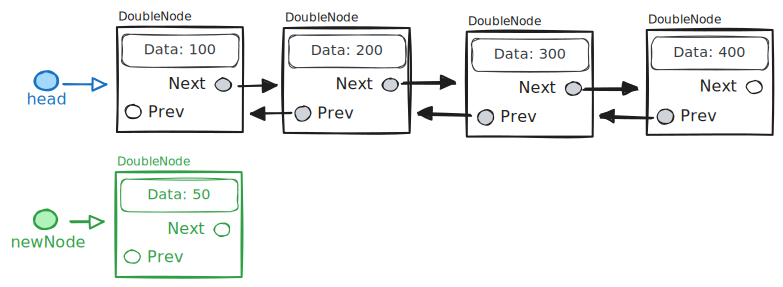

# Doubly Linked Lists

Textbook sections:

- 4.6 Doubly-linked lists
- 4.7 Doubly-linked lists: Insert
- 4.8 Doubly-linked lists: Remove

We'll use the following repository during lecture: https://github.com/eu-cpsc211/exercise-linked-list

## Doubly Linked List

A doubly linked list is the same as a singly linked list except for the addition of a pointer that points to the previous node in the list.

```cpp
class DoubleNode {
  public:
    int data;
    DoubleNode* next;
    DoubleNode* prev;
};
```



### Prepend



- Allocate a new node.
- Update `next` and `prev` pointers so the new node is part of the list.
- Adjust `head` pointer to point to new node.

Things to consider:

- What if `head` is null (empty list)?
- What if `head` is the only node in the list before inserting the new node?

### Insert



- Allocate a new node.
- Get a pointer to the node you want to insert after.
- Update `next` and `prev` pointers so the new node is part of the list.

### Remove



- Get a pointer to the node in front of the node you are going to delete.
- Update `next` and `prev` pointers to exclude the old node from the list.
- Delete the old node to free its memory.

### Append



- Allocate a new node.
- Get a pointer to the last item in the list.
- Update `next` and `prev` pointers so the new node is part of the list.

Sometimes it is useful to keep a `tail` pointer around (alongside the `head` pointer) that always points to the last node in the list.

## Exercise

TBD

## Study Guide

### Code example 1

Assume the code below has just been executed when answering the following questions.

```cpp
class DoubleNode {
  public:
    int data;
    DoubleNode* next;
    DoubleNode* prev;
};

int main()
{
    DoubleNode* tail = new DoubleNode();
    DoubleNode* head = tail;

    tail->data = 165;
    tail->next = nullptr;
    tail->prev = nullptr;

    DoubleNode* ptr = new DoubleNode();
    ptr->data = 32;
    ptr->next = head;
    ptr->prev = nullptr;
    head->prev = ptr;
    head = ptr;

    ptr = new DoubleNode();
    ptr->data = 11;
    ptr->next = head;
    ptr->prev = nullptr;
    head->prev = ptr;
    head = ptr;

    ptr = new DoubleNode();
    ptr->data = 7901;
    ptr->next = head;
    ptr->prev = nullptr;
    head->prev = ptr;
    head = ptr;

    // ...
}
```

- What is the correct order of all data values in the linked list?

- What would be output by each of the following statements?

  - `cout << head->data << endl;`
  - `cout << head->next->data << endl;`
  - `cout << head->next->next->data << endl;`
  - `cout << ptr->data << endl;`
  - `cout << ptr->next->data << endl;`
  - `cout << tail->data << endl;`
  - `cout << tail->prev->data << endl;`
  - `cout << tail->prev->prev->data << endl;`

- What is the value of `head->prev` and `tail->next`?

- What would the following code print?

  ```cpp
  while (ptr != NULL) {
      cout << ptr->data << " ";

      if (ptr->prev != NULL)
          cout << ptr->prev->data << " ";

      ptr = ptr->next;
  }
  ```

- What is the result of the Boolean expression `head->next == head->next->next`?

### Code example 2

Assume the code below has just been executed when answering the following questions.

```cpp
class DoubleNode {
  public:
    int value;
    DoubleNode* next;
    DoubleNode* prev;
};

int main()
{
    DoubleNode* head = new DoubleNode();
    DoubleNode* tail = head;

    head->value = 165;
    head->next = nullptr;
    head->prev = nullptr;
    tail->next = head;

    DoubleNode* newNode = new DoubleNode();
    newNode->value = 32;
    newNode->next = nullptr;
    newNode->prev = tail;
    tail->next = newNode;
    tail = newNode;

    newNode = new DoubleNode();
    newNode->value = 11;
    newNode->next = nullptr;
    newNode->prev = tail;
    tail->next = newNode;
    tail = newNode;

    newNode = new DoubleNode();
    newNode->value = 7901;
    newNode->next = nullptr;
    newNode->prev = tail;
    tail->next = newNode;
    tail = newNode;

    // ...

    return 0;
}
```

- What is the correct order of all data values in the linked list?

- What would be output by each of the following statements?

  - `cout << head->data << endl;`
  - `cout << head->next->data << endl;`
  - `cout << head->next->next->data << endl;`
  - `cout << ptr->data << endl;`
  - `cout << ptr->next->data << endl;`
  - `cout << tail->data << endl;`
  - `cout << tail->prev->data << endl;`
  - `cout << tail->prev->prev->data << endl;`

- What would the following code print?

  ```cpp
  ptr = tail;

  while (ptr != NULL) {
      cout << ptr->data << " ";

      if (ptr->prev != NULL)
          cout << ptr->prev->data << " ";

      ptr = ptr->next;
  }
  ```

### Operations examples

- Consider the following doubly linked list. Write three lines of C++ code that would remove `b` from the list and free its memory.



- Consider the following doubly linked list. Write three lines of C++ code that would insert `newNode` into the linked list after the `head` node (i.e., the new node will be the second item in the list).



- Consider the following function `Append()`. Implement the function so the node pointed to by `newNode` is appended to the end of the list. The `head` pointer points to the first node in the list.

```cpp
void Append(DoubleNode* head, DoubleNode* newNode)
{
    // TODO
}
```
