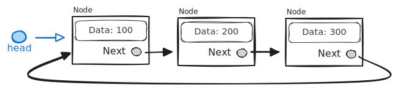
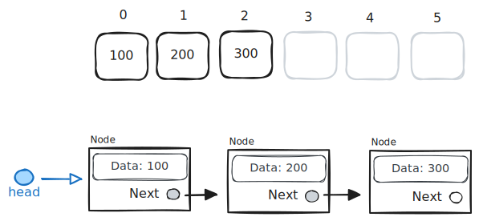

# More list things

Textbook:

- 4.9 Linked list traversal
- 4.10 Linked list dummy nodes
- 4.11 Linked list search
- 4.12 List data structure
- 4.13 Circular lists

## Traversal

Example walking a singly linked list:

```cpp
Node* head;
Node* cur = head;

while (cur != nullptr) {
    // Do something with the node
    cout << cur->data << endl;

    // Advance pointer
    cur = cur->next;
}
```

Example walking a doubly linked list:

```cpp
DoubleNode* tail;
DoubleNode* cur = tail;

while (cur != nullptr) {
    // Do something with the node
    cout << cur->data << endl;

    // Advance pointer
    cur = cur->prev;
}
```

## Circular lists

Consider a singly linked list. If the last node in the list sets its `next` pointer to point to the first node in the list, you have a circular list.



Be careful when traversing a circular linked list. There will never be a null `next` pointer. If you write a loop expecting one, you'll wind up with an infinite loop.

## Arrays vs linked lists



Compare an array list with a linked list for different scenarios, such as:

- Getting an item at a specific index.
- Inserting an item at a specific index.

## Lists in C++ and other languages

Below are some examples of list data types in C++ and a few select languages. The intricacies of the different languages are not explored, but these should be good tip-of-the-iceberg examples.

### C++

There is a built-in `vector` class that acts like a list ADT. If you need a list in C++, this is the go-to data type.

```cpp
#include <iostream>
#include <vector>

using namespace std;

int main()
{
    vector<int> list;

    // Append
    list.push_back(100);
    list.push_back(200);
    list.push_back(300);

    // Insert
    list.insert(list.begin() + 1, 50);

    // Remove
    list.erase(list.begin() + 2);

    // Access item at index
    cout << list.at(1) << endl;
    cout << list[1] << endl;

    // Get size
    cout << "Size: " << list.size() << endl;

    for (int i : list) {
        cout << i << endl;
    }

    // Clear
    list.clear();

    cout << "Size: " << list.size() << endl;

    return 0;
}
```

There are a few other containers in C++ that are similar, but are implemented differently and therefore exhibit different performance characteristics in different scenarios.

- [list](https://en.cppreference.com/w/cpp/container/list)
- [forward_list](https://en.cppreference.com/w/cpp/container/forward_list)
- [deque](https://en.cppreference.com/w/cpp/container/deque)

### C#

https://dotnetfiddle.net

The `List` class does what you expect in C#.

```csharp
using System;
using System.Collections.Generic;

public class Program
{
	public static void Main()
	{
		var list = new List<int>();

		// Append
		list.Add(100);
		list.Add(200);
		list.Add(300);

		// Insert
		list.Insert(1, 50);

		// Remove
		list.RemoveAt(2);

		// Access item at index
		Console.WriteLine(list[1]);

    	// Get size
		Console.WriteLine($"Size: {list.Count}");

		foreach (var i in list) {
			Console.WriteLine(i);
		}

		// Clear
		list.Clear();

		Console.WriteLine($"Size: {list.Count}");
	}
}
```

### JavaScript

No built-in "list" type, but an array in JavaScript can act like one.

```javascript
let list = [];

// Append
list.push(100);
list.push(200);
list.push("hello 300");

// Insert
list.splice(1, 0, 50);

// Remove (no remove at index here)
list.splice(1, 1);

// Access item at index
console.log(list[1]);

// Get size
console.log(list.len);

console.log(list);

// Clear
list = [];

console.log(list);
```

You can do some wild things with JavaScript arrays beyond just acting like a list.

```javascript
let list = new Array();
list.push(12);
list[3] = "hello";
list["key"] = "value";
list.push(10);
console.log(list);
```

See: https://www.youtube.com/watch?v=D5xh0ZIEUOE

### Python

Python lists are similar to JavaScript arrays in that they are pretty flexible.

```python
list = []

# Append
list.append(100);
list.append(200);
list.append("hello 300");

# Insert
list.insert(1, 50)

# Remove (no remove at index here)
list.remove(200)

# Access item at index
print(list[1])

# Get size
print(len(list))

print(list)

# Clear
list.clear();

print(list)
```

## Study guide

### Linked list reversal

Suppose you have a singly linked list comprised of nodes using the following class.

```cpp
class Node {
  public:
    int data;
    Node* next;
};
```

Given a `head` pointer that points to the first node in the list, develop an algorithm to reverse the linked list.

For example, if you have a linked list that looks like:

```
head -> 1 -> 2 -> 3 -> 4 -> 5
```

After the reversal, the list would look like:

```
head -> 5 -> 4 -> 3 -> 2 -> 1
```

You can write the algorithm with pseudocode or C++ code. Then come up with the appropriate Big O notation for a worst-case runtime complexity of your algorithm.

### Circular lists

- In what scenario is a node's `next` pointer null in a circular linked list?
- In what scenario is the `head` pointer null in a circular linked list?
- How would a doubly linked list be made circular?
- Given a `head` pointer, write a block of C++ code that would remove the last node from a circular, singly linked list.
