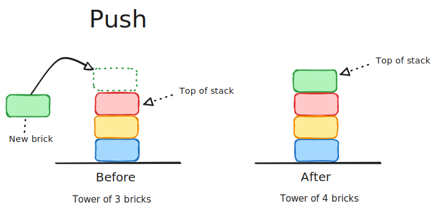
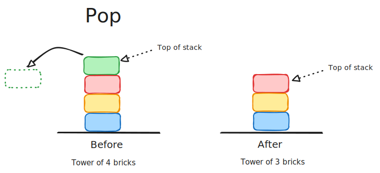
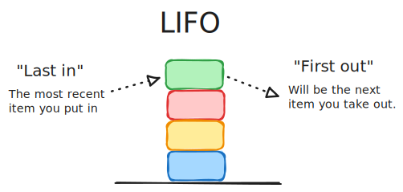
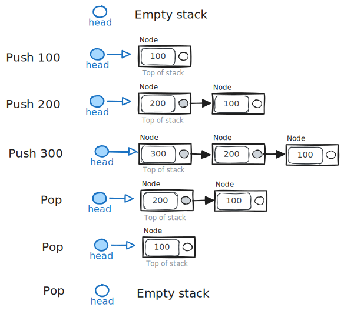

# Stacks

Textbook sections:

- 5.1 Stack abstract data type (ADT)
- 5.2 Stacks using linked lists
- 5.3 Array-based stacks

## Stack ADT

A stack data structure acts how you might expect. It grows by placing new items on the top and shrinks by removing items from the top.

There are two basic operations you can perform on a stack:

- Push: add a new item to the top of the stack.
- Pop: remove the top item from the stack.

You can think of it like a tower of bricks.

A "push" operation places a new brick on the top of the tower.



A "pop" operation removes the topmost brick from the tower.



### LIFO

A stack has the characteristics of a LIFO data structure. LIFO stands for "Last In, First Out". This means the last item you put into the stack will be the first item you remove from the stack.

In other words, the top item in the stack is **both**:
- the most recent item you pushed onto the stack.
- the item that will be removed if you performed a pop operation right now.



## Implementing stacks

Stacks are an abstract concept and can be applied to different situations. You can also implement stacks using different tools. Like lists, we'll look at implementing stacks with both arrays and linked lists.

### Bounded vs unbounded

A bounded stack has a maximum capacity limit. Once the stack grows to that limit, no more items can be pushed.

An unbounded stack does not have a limit (theoretically). You can keep adding items until you run out of memory.

### Bounded stack using arrays

You can implement a bounded stack using a fixed-size array.

- Use a variable to track how many items are in the stack (ex: `size`).
- A push insert an item at the end of the list and increments `size`.
- A pop decrements `size`.
- You can always get the top of the stack using `stack[size - 1]`.

Example: https://onecompiler.com/cpp/43ay9k7gg

```cpp
#include <iostream>
using namespace std;

// Helper function to print the stack to std output
void PrintStack(int* stack, int size)
{
  cout << "Stack [bottom] ";

  for (int i = 0; i < size; i++) {
    cout << stack[i] << " ";
  }

  cout << "[top]" << endl;
}

int main() 
{
  // Bounded stack - array size is fixed
  int stack[5];
  int size = 0;

  // Push
  stack[size++] = 100;
  stack[size++] = 200;
  stack[size++] = 300;
  
  PrintStack(stack, size);
  
  // Pop
  int val = stack[--size];
  cout << val << endl;

  PrintStack(stack, size);

  // Push
  stack[size++] = 400;
  stack[size++] = 500;
  stack[size++] = 600;
  
  PrintStack(stack, size);
  
  // Stack is full now, so no more pushes are allowed
  //stack[size++] = 700;

  return 0;
}
```

Exercise: https://onecompiler.com/cpp/43aycefvr

- Implement the functions with `TODO` comments.

### Unbounded stack using arrays

An unbounded stack can also be implemented using an array, but you will need to handle resizing the array when it gets full. This is the same concept as when implementing a list data structure using an array.

Exercise: https://onecompiler.com/cpp/43b32thpp

There are many different to approach dynamically resizing an array. For this exercise you can keep it simple:

- Double the size of the array when the stack gets full.
- Don't bother shrinking the array when the stack shrinks back down.

### Unbounded stack using linked lists

One way to do a linked-list implementation:

- Have the `head` pointer point to the top of the stack.
- When a push happens, prepend a new node to the front of the list.
- When a pop happens, remove the head node from the list.



Exercise: https://onecompiler.com/cpp/43bbzbnzz

- Implement the functions with `TODO` comments.

## Stacks in C++ STL

The C++ standard library has a built-in stack data structure. Technically it acts like a wrapper around other container data types, so you can choose what the backing type of container for your stack will be (`vector`, `list`, `deque`, etc.).

See: https://en.cppreference.com/w/cpp/container/stack

It is worth noting that the `pop` function of the `stack` type in C++ does not return a value. Some pop functions in other implementations return the value that was just popped. With the built-in `stack` type (if you want to use the value you pop) you must first read the topmost value with the `top` function, then remove it with `pop`.

```cpp
#include <cmath>
#include <iostream>
#include <list>
#include <stack>
#include <vector>

using namespace std;

int main()
{
    // Stack using default backing container (a deque)
    stack<int> defaultStack;
    defaultStack.push(100);
    defaultStack.push(200);

    cout << defaultStack.top() << endl;
    defaultStack.pop();
    cout << defaultStack.top() << endl << endl;

    // Stack using a vector as the backing container
    stack<int, vector<int>> vectorStack;
    vectorStack.push(300);
    vectorStack.push(400);

    cout << vectorStack.top() << endl;
    vectorStack.pop();
    cout << vectorStack.top() << endl << endl;

    // Stack using a list as the backing container
    stack<int, list<int>> listStack;
    listStack.push(500);
    listStack.push(600);

    cout << listStack.top() << endl;
    listStack.pop();
    cout << listStack.top() << endl << endl;

    return 0;
}
```

## Study guide

Coming soon.
