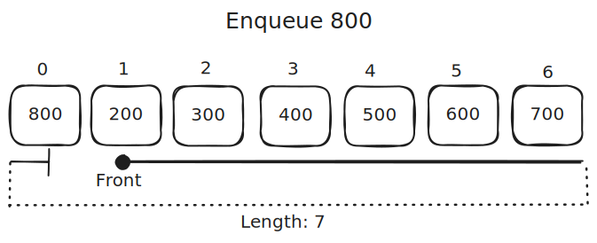

# Queues

Textbook sections:

- 5.4 Queue abstract data type (ADT)
- 5.5 Queues using linked lists
- 5.6 Array-based queues
- 5.7 Deque abstract data type (ADT)

## Queue ADT

Consider a line of people waiting to buy tacos from a taco truck.

There is a front of the line and a back of the line. The person in the front of the line gets served first, the person in the back of the line has to wait their turn. New people who show up have to join the back of the line.

This is an example of a queue data structure.


There are two basic operations you perform with queues:

- Enqueue: add an item to the back of the queue.
- Dequeue: remove an item from the front of the queue.


### FIFO

A queue has the characteristics of a FIFO data structure. FIFO stands for "First In, First Out". This means the first item in the queue will be the next item you remove from the queue.

This makes sense when you think about the taco truck analogy. The first person in line is the first person to get served.


### Other operations

Enqueue and dequeue are the primary operations of a queue. The name of these operations may vary depending on the implementation.

You may find other operations as well, such as:

- Peek: check what's at the front of the queue, but don't remove it.
- IsEmpty: check if the queue is empty.
- GetLength/GetSize: check how many items are in the queue.

## Queues using arrays

As with stacks, both bounded and unbounded queues are possible. We'll look at a bounded queue here.

Consider the following code that creates an empty queue using an array:

```cpp
int frontIndex = 0;  // Where the queue starts.
int length = 0;      // Current number of items in the queue.
int maxLength = 7;   // Maximum number of items that are allowed.
int* queue = new int[maxLength];
```

The queue is currently empty. There is no item in the front of the queue.


If we enqueue a new item, we can store it in the first slot in the array. You can use the `frontIndex` and the `length` variables to determine where the back of the queue is.


This pattern can continue until the queue is full.


With a bounded queue, you cannot add any more items if the queue is full.

If we dequeue an item at this point, it gets removed from the front of the queue. The `fontIndex` variable is incremented accordingly.


Is it possible to enqueue an item at this point? Yes! The queue will wrap around back to the beginning of the array.



This is called a circular array. When you reach the end, you wrap back around to the beginning.

Enqueues and dequeues can continue indefinitely (of course with a bounded queue you can only enqueue as long as the queue is not full). 


Using the variables `length`, `maxLength`, and `frontIndex`, we can always determine the index **where a new item will be enqueued**.

```cpp
int enqueueAt = (frontIndex + length) % maxLength;
```

Exercise: https://onecompiler.com/cpp/43brc4urf

- Implement the functions with `TODO` comments.

## Queues using linked lists

One possible implementation:

- `head` pointer points to front of queue.
- `tail` pointer points to back of queue.
- Enqueue appends item to back of linked list.
- Dequeue removes item from front of linked list.


Exercise: https://onecompiler.com/cpp/43bss3meh

- Implement the functions with `TODO` comments.

## Study guide

Coming soon.
