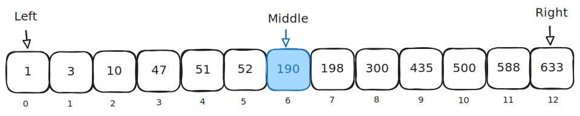
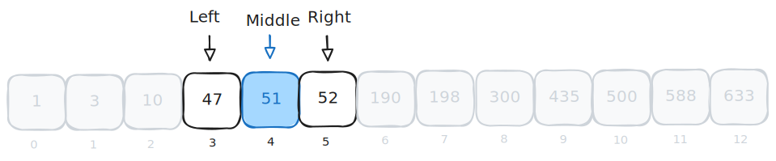

# Searching

Textbook sections:

- 6.1 Searching and algorithms
- 6.2 Binary search

## Linear search

Starting at the beginning of the input dataset, check each item from beginning to end until you find the item you are looking for (or reach the end). Also known as a sequential search.

```cpp
int Search(const vector<int>& numbers, int target)
{
    for (int i = 0; i < numbers.size(); i++) {
        if (numbers[i] == target) {
            return i;
        }
    }

    return -1;
}
```

Runtime complexity in the worst case is linear. You have to perform a comparison against every item in the dataset.

## Binary search

- Input dataset must be sorted.
- Cut the input dataset in half each iteration.

### Example: search for 588

Consider the sorted input dataset below:


We want to find the value 588 in this dataset using a binary search algorithm.

Start by establishing the left, middle, and right indices of the dataset.



Look at the middle item (190) and compare it to the item we are searching for (588). In this case, 190 is less than 588.

Since the input dataset is sorted, we now know that all items to the left are guaranteed to not contain the item we are looking for. We can cut the dataset in half before continuing our search.


With the reduced dataset, establish the new left, middle, and right indices.


If a dataset has an even number of items, you can round down when picking the middle item. In this example you can compute the middle index with `(7 + 12) / 2`. Integer division will yield a result of `9`. Thus, we use index 9 as the middle item.

Comparing the middle item (435) with the item we are searching for (588), we see that 435 is less than 588. Therefore, we can further reduce our dataset to eliminate all values lower than 435.


Establish the new left, middle, and right indices.


At this point, the middle item in our reduced dataset is equal to the item we are searching for. That means we found the target item and the search is over.

### Example: search for 52

Here's another example using the same dataset. Once again, the dataset is presorted. This time we are searching for the value 52.


We start by establishing the left, middle, and right indices of the dataset.


Compare the middle element (190) to the item we are searching for (52). From this, we can infer the value we are looking for is in the left half of the dataset. This cuts our search space in half.


Establish the left, middle, and right indices of the reduced dataset.


Compare the middle element (10) with the item we are searching for (52). We can further eliminate part of the dataset based on this comparison.


Establish the left, middle, and right indices of the reduced dataset.



Compare and reduce.


We wind up with a single item left, so the left, middle, and right indices all point to the same item.

The final comparison checks if the remaining item is the one we are looking for. In this case, it is.


### Implementation

Example of C++ code performing a binary search.

```cpp
#include <iostream>
#include <vector>

using namespace std;

int Search(const vector<int>& values, int target)
{
    cout << "Begin search for " << target << endl;

    // Establish left/middle/right of initial dataset
    int left = 0;
    int right = values.size() - 1;
    int middle = (right + left) / 2;

    // Continue until our search space has collapsed (dataset reduced to no elements)
    while (left <= right) {
        cout << "Pass: " << left << " " << middle << " " << right << endl;

        if (values[middle] == target) {
            // Found this target item
            return middle;
        }
        else if (values[middle] < target)
        {
            // Middle element is too small, look in the right half
            // (left index of search space shrinks to right)
            left = middle + 1;
        }
        else {
            // Middle element is too big, look in the left half
            // (right index of search space shrinks to left)
            right = middle - 1;
        }

        // Update middle item based on the reduced search space
        middle = (left + right) / 2;
    }

    // Did not find this target item
    return -1;
}

int main()
{
    vector<int> values = { 1, 3, 10, 47, 51, 52, 190, 198, 300, 425, 500, 588, 633 };
    int index = Search(values, 588);
    cout << index << endl;

    return 0;
}
```

### Exercise: player search

https://onecompiler.com/cpp/43d9anmjj

Implement a binary search to find a player by name.

### Complexity analysis

Question: what is the runtime complexity of a binary search in the worst case?

Question: what are the trade-offs of a binary search?

## Study guide

- What are the constraints of the input dataset when doing a binary search?
- Compare the runtime complexity of a linear search and binary search.
- Be able to read and write code that implements a binary search.
- Be able to read and write code that implements a linear search.
