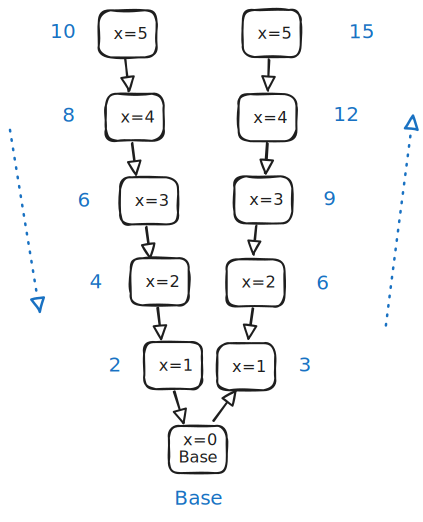

# Recursion

Textbook:

- 7.1 Recursion: Introduction
- 7.2 Recursive functions
- 7.3 Recursive algorithm: Search
- 7.4 Adding output statements for debugging
- 7.5 Creating a recursive function
- 7.6 Recursive math functions
- 7.7 Recursive exploration of all possibilities
- 7.8 Stack overflow

Notes:

[pythontutor.com](https://pythontutor.com/cpp.html#mode=edit) provides a tool to visualize the execution of C++ programs, which is handy when learning about recursive functions.

The Visual Studio debugger is great way of visualizing the execution of recursive functions. You should be comfortable using the debugger in Visual Studio (or whatever development tools you use).

## Recursive functions

A recursive function is a function that calls itself.

_Example 1:_

```cpp
void PrintNumbers(int n)
{
    cout << n << " ";
    PrintNumbers(n - 1);
}
```

- What is the problem with this function?

_Example 2:_

```cpp
void PrintNumbers(int n)
{
    if (n < 0)               // Base case
        return;

    cout << n << " ";        // General/recursive case
    PrintNumbers(n - 1);
}
```

- A **base case** is a branch in the function that does _not_ call itself. It is triggers the end of the recursive chain.
- A **general case** or (**recursive case**) is a branch in the function that performs a recursive call.

You can draw a diagram to visualize the chain of recursive calls and the state of variable within each call. The diagram below illustrates the execution of the code for example 2 if the first function call is `PrintNumbers(3)`.


_Example 3:_

```cpp
int Example(int x)
{
    if (x > 20)
        return x;
    else if (x % 2 == 0)
        return Example(x + 1);
    else
        return Example(x * 2);
}
```

- What is returned by the call `Example(5)`?
- What is returned by the call `Example(2)`?


_Example 4:_

```cpp
void Example(int x)
{
    if (x == 1)
        cout << "A" << endl;
    else if (x == 2)
        cout << "B" << endl;
    else if (x <= 0 )
        cout << "Invalid" << endl;
    else if (x % 2 == 0)
        return Example(x / 3);
    else
        return Example(x / 2);
}
```

- What is output by the call `Example(13)`?
- What is output by the call `Example(14)`?
- What is output by the call `Example(15)`?

### Tail vs. non-tail recursion

**Tail recursion** happens when the recursion happens as the last act of the function. All the examples so far have been examples of tail recursion.

A non-tail recursion happens if additional actions are taken _after_ the recursive call is made.

_Example 5_:

```cpp
void Example(int x)
{
    cout << x * 2 << " ";

    if (x <= 0)
        cout << "Base ";
    else
        Example(x - 1);

    cout << x * 3 << " ";
}
```

- What is displayed by the call `Example(12)`?



_Example 6_:

```cpp
int Example(int x)
{
    if (x > 15)
        return x - 1;
    else
        return x + Example(x + 1);
}
```

- What is return by the call `Example(5)`?

## Divide and conquer

Recursion lends itself nicely to **divide and conquer** algorithms. These algorithms repeatedly break a problem down into smaller subsets.

### Binary search

_Example 7_: Binary search function using recursion.

```cpp
#include <iostream>
#include <vector>

using namespace std;

int BinarySearch(const vector<int>& data, int left, int right, int target)
{
    // Not found
    if (left > right)
        return -1;

    // Find middle index
    int middle = (left + right) / 2;
    int num = data.at(middle);

    // Check if middle is the target
    if (num == target)
        return middle;

    // Recursively search left or right side
    if (num > target)
        right = middle - 1;
    else
        left = middle + 1;

    return BinarySearch(data, left, right, target);
}

int BinarySearch(const vector<int>& data, int target)
{
    return BinarySearch(data, 0, data.size() - 1, target);
}

int main()
{
    vector<int> values = { 1, 3, 10, 47, 51, 52, 190, 198, 300, 425, 500, 588, 633 };
    int index = BinarySearch(values, 588);
    cout << index << endl;

    return 0;
}
```

### Merge sort

- [Merge sort slides](https://docs.google.com/presentation/d/1ip_cA7r6phrspmCIhjs8yWZORvAZuAMIknfSN0yXZ6k/edit?usp=sharing)
- [Merge sort example code](../../examples/7-merge-sort/main.cpp)

## Recursion and iteration

A tail recursive function can be converted into a regular function with iteration (and vice-versa).

The following recursive function prints out all odd numbers starting at `n` and going down to `1`. Convert it into a regular function using iteration.

```cpp
void PrintOdds(int n)
{
    if (n <= 0)
        return;

    if (n % 2 != 0)
        cout << n << " ";

    PrintOdds(n - 1);
}
```

The following iterative function searches a linked list and returns a pointer to the node containing the desired value (or `nullptr` if not found). Convert this into a recursive function.

https://onecompiler.com/cpp/43e2xgq46

```cpp
Node* FindIterative(Node* head, int target)
{
    Node* next = head;
    while (next) {
        if (next->data == target)
            return next;

        next = next->next;
    }

    return nullptr;
}
```

## Complexity analysis

What is the proper Big O category for the following function when using the variable `n` as the problem size?

```cpp
int Example(int n)
{
    if (n > 20)
        return n;
    else if (n % 2 == 0)
        return Example(n + 1);
    else
        return Example(n * 2);
}
```

## Study Guide

### General

- What is tail recursion?

### Code examples

Practice 1:

```cpp
int Example(int n)
{
    if (n > 4)
        return n + Example(n - 2);
    else
        return n;
}
```

- Which lines represent the base case(s) and which lines represent the general case(s)?
- What is the output of `cout << Example(8)`?

Practice 2:

```cpp
int Example(int a, int b)
{
    if (a > b)
        return a + b;
    else if (a < b)
        return b + Example(b + 1, a - 1);
    else
        return a - b;
}
```

- Which lines represent the base case(s) and which lines represent the general case(s)?
- What is the output of `cout << Example(3, 7)`?

Practice 3:

```cpp
int Example(int a)
{
    if (a <= 0)
    {
        return a;
    }
    else
    {
        int x = Example(a - 1);
        int y = Example(a - 2);
        return x + y;
    }
}
```

- Which lines represent the base case(s) and which lines represent the general case(s)?
- What is the output of `cout << Example(3)`?

Practice 4:

```cpp
int Example(int n)
{
    if (n == 0)
        return 1;
    else
        return n * Example(n - 1);
}
```

- Which lines represent the base case(s) and which lines represent the general case(s)?
- What is the output of `cout << Example(5)`?

Practice 5:

```cpp
void Example(int n)
{
    cout << n + 1 << " ";

    if (n > 1)
    {
        cout << n + 2 << " ";
        Example(n - 1);
    }

    cout << n - 1 << " ";
}
```

- What is the output of `Example(4)`?
- What is the output of `Example(1)`?

### Complexity analysis

What is the proper Big O category for the following function when using the variable `n` as the problem size?

```cpp
int Example(int a, int b, int n)
{
    if (n <= 1)
        return a + b;
    else
        return Example(b, a + b, n - 1);
}
```

What is the proper Big O category for the following function when using the variable `n` as the problem size?

```cpp
int Example(int n)
{
    if (n <= 0)
        return n;
    else
        return Example(n - 1) + Example(n - 2);
}
```
