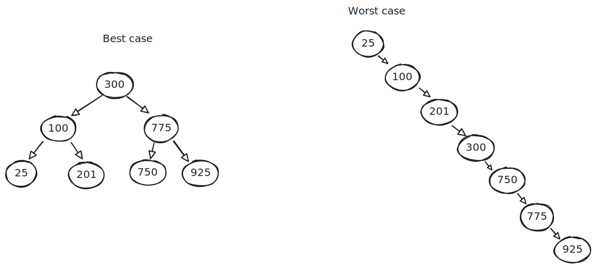
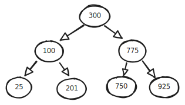
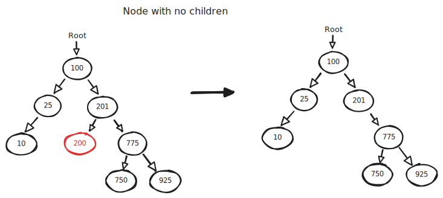
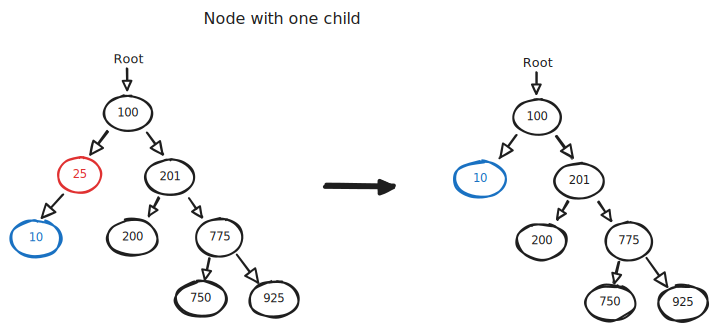
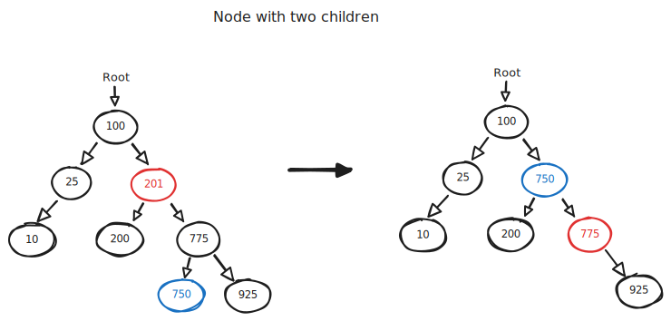
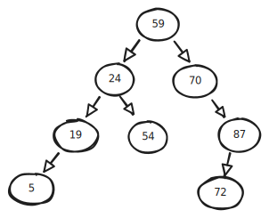
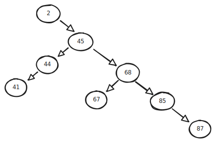

# Binary Search Trees

Textbook:

- 8.1 Binary trees
- 8.2 Applications of trees
- 8.4 BST search algorithm
- 8.5 BST insert algorithm
- 8.6 BST remove algorithm
- 8.7 BST inorder traversal
- 8.8 BST height and insertion order
- 8.9 BST parent node pointers

## Trees

Linked list:

- Flat/linear relationship between nodes.

Tree:

- Hierarchical relationship between nodes.

Nodes in a tree have relationships similar to a family tree.

- A **parent** node comes directly above **child** nodes.
- A node is an **ancestor** of any nodes below it (children, grandchildren, and so on).
- A node is a **descendant** of any parent nodes in directly line back up to the root.

## Binary Trees

A binary tree is a type of tree whose nodes can have a maximum of two children.

Nodes have different classifications:

- **Root** - the top level node.
- **Internal** - a node with at least one child. The root node can also be classified as an internal node if it meets this requirement.
- **Leaf** - a node with no children. The root node can also be classified as a leaf node if it meets this requirement.

Other tree properties:

- **Height** - how many levels of descendant nodes there are.
- **Depth** - which level a particular node is at.

Trees themselves can have different classifications:

- **Full** - all nodes have either zero or two nodes.
- **Complete** - nodes are populated in from left to right, top to bottom with no gaps. The last level may have missing nodes, but nodes must be as far left as possible.
- **Perfect** - all possible nodes are present for the current tree height.

These classifications are not mutually exclusive. A tree can be full, complete, _and_ perfect, or some combination thereof.

## Binary Search Trees

A binary search tree (BST) is organized so nodes are sorted.

- All nodes in the left subtree of any node are `<=`.
- All nodes in the right subtree of any node are `>`.

### Traversal

- **In-order**

  - Visit left subtree
  - Visit root node
  - Visit right subtree

- **Pre-order**

  - Visit root node
  - Visit left subtree
  - Visit right subtree

- **Post-order**
  - Visit left subtree
  - Visit right subtree
  - Visit root node

For the following BST, write out each node in order using each of the three traversal methods listed above.

#### Exercise

https://onecompiler.com/cpp/43ervjrf6

Implement the sorting methods in the provided code. The exercise uses the BST below:

### Insertion

BST visualizations:

- https://visualgo.net/en/bst
- https://www.cs.usfca.edu/~galles/visualization/BST.html

Inserting into a BST:

- If tree is empty, new node becomes root.
- Else, check root node.
  - If new value < root:
    - If left child null: link new node here.
    - Else: insert into left subtree.
  - If new value >= root:
    - If right child null: link new node here.
    - Else: insert into right subtree.

Complexity:

- Best case: $O(\log n)$
- Worst case: $O(n)$

Examples:

Consider this BST:

- Draw the BST after the following numbers have been inserted using the algorithm above: `400`, `500`, `50`, `75`, `800`.

### Deletion

Deleting from a BST:

- If target is leaf node: delete target and update parent.
- If target has one child: replace target with child.
- If target has two children:

  - Find successor (leftmost descendant of target's _right_ subtree).
  - Replace target with successor.

- Update root pointer as needed.

## Study guide

### General

- Given a diagram of a BST:

  - Determine the height of the tree.
  - Determine the depth of any given node within the tree.
  - Determine if the tree is full.
  - Determine if the tree is complete.
  - Determine if the tree is perfect.
  - Be able to traverse the tree using in-order, pre-order, and post-order algorithms.

- Given a list of numbers, draw a diagram of a BST using those numbers.

- Given a diagram of a BST:
  - Draw the result of inserting items into the tree.
  - Draw the result of removing items from the tree.

You can generate sample BSTs to practice with here: https://visualgo.net/en/bst.

### Example

Use the BST diagram below to answer the following questions.

Part 1:

- What is the height of this tree?
- What is the depth of node 54?
- What is the depth of node 70?
- What is the depth of node 59?
- Is this tree perfect?
- Is this tree full?
- Is this tree complete?

Part 2:

- Draw a diagram of the tree after the following numbers are inserted in order: `20`, `25`, `58`.

### Example

Create a **perfect** BST out of the following numbers: `8`, `4`, `14`, `10`, `12`, `2`, `6`.

### Example

Create a BST that is not perfect, not full, and not complete out of the following numbers: `24`, `28`, `18`, `22`, `20`.

### Example

Use the BST diagram below to answer the following questions.

Part 1:

- List all numbers in this tree using in-order, pre-order, and post-order traversal.

Part 2:

- Draw diagram of the tree after deleting node `2`.

Part 3 (after deleting node `2`):

- What is the height of the tree?
- What is the depth of node `44`?
- What is the depth of node `41`?
- What is the depth of node `87`?
