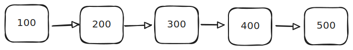
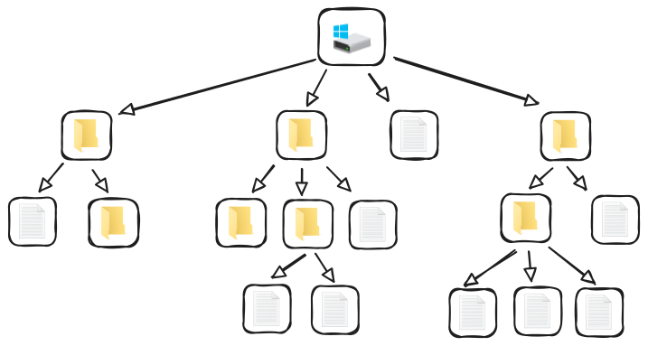
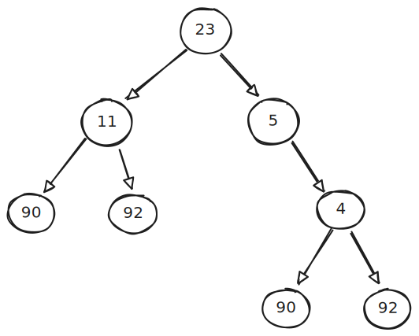
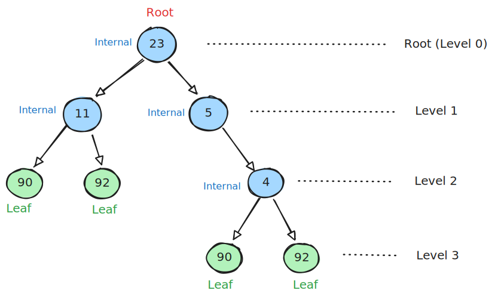
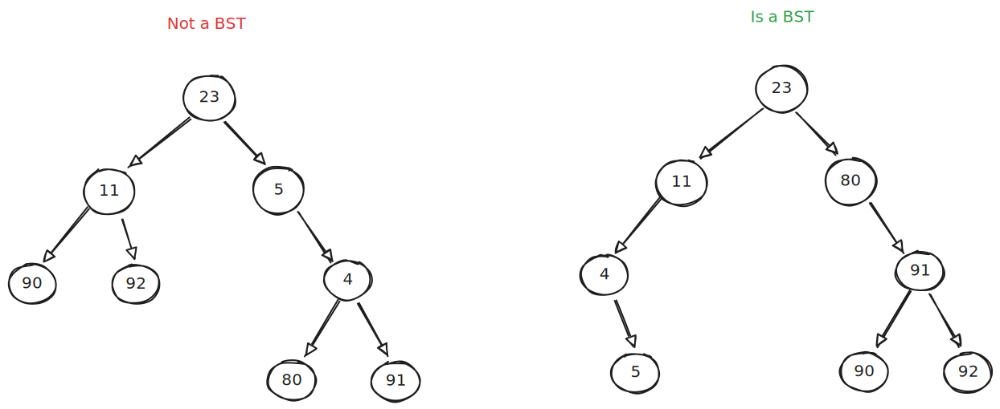
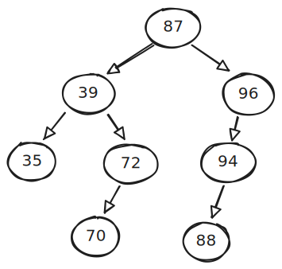
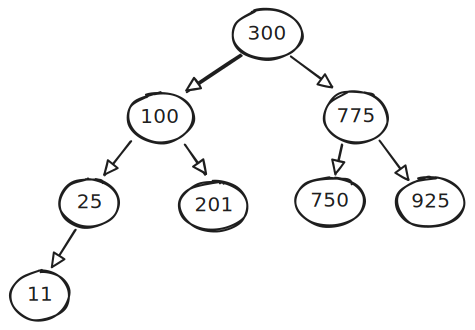

# Binary Search Trees

Textbook:

- 8.1 Binary trees
- 8.2 Applications of trees
- 8.4 BST search algorithm
- 8.5 BST insert algorithm
- 8.6 BST remove algorithm
- 8.7 BST inorder traversal
- 8.8 BST height and insertion order
- 8.9 BST parent node pointers

## Trees

Linked list:

- Flat/linear relationship between nodes.

Tree:

- Hierarchical relationship between nodes.

Nodes in a tree have relationships similar to a family tree.

- A **parent** node comes directly above **child** nodes.
- A node is an **ancestor** of any nodes below it (children, grandchildren, and so on).
- A node is a **descendant** of any parent nodes in directly line back up to the root.

## Binary Trees

A binary tree is a type of tree whose nodes can have a maximum of two children.

Nodes have different classifications:

- **Root** - the top level node.
- **Internal** - a node with at least one child. The root node can also be classified as an internal node if it meets this requirement.
- **Leaf** - a node with no children. The root node can also be classified as a leaf node if it meets this requirement.

Other tree properties:

- **Height** - how many levels of descendant nodes there are.
- **Depth** - which level a particular node is at.

Trees themselves can have different classifications:

- **Full** - all nodes have either zero or two nodes.
- **Complete** - nodes are populated in from left to right, top to bottom with no gaps. The last level may have missing nodes, but nodes must be as far left as possible.
- **Perfect** - all possible nodes are present for the current tree height.

These classifications are not mutually exclusive. A tree can be full, complete, _and_ perfect, or some combination thereof.

## Binary Search Trees

A binary search tree (BST) is organized so nodes are sorted.

- All nodes in the left subtree of any node are `<=`.
- All nodes in the right subtree of any node are `>`.

### Traversal

- **In-order**

  - Visit left subtree
  - Visit root node
  - Visit right subtree

- **Pre-order**

  - Visit root node
  - Visit left subtree
  - Visit right subtree

- **Post-order**
  - Visit left subtree
  - Visit right subtree
  - Visit root node

Example: for the following BST, write out each node in order using each of the three traversal methods listed above.

#### Exercise

https://onecompiler.com/cpp/43ervjrf6

Implement the sorting methods in the provided code. The exercise uses the BST below:

